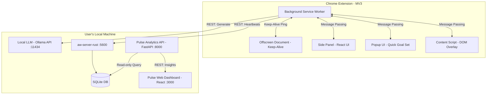
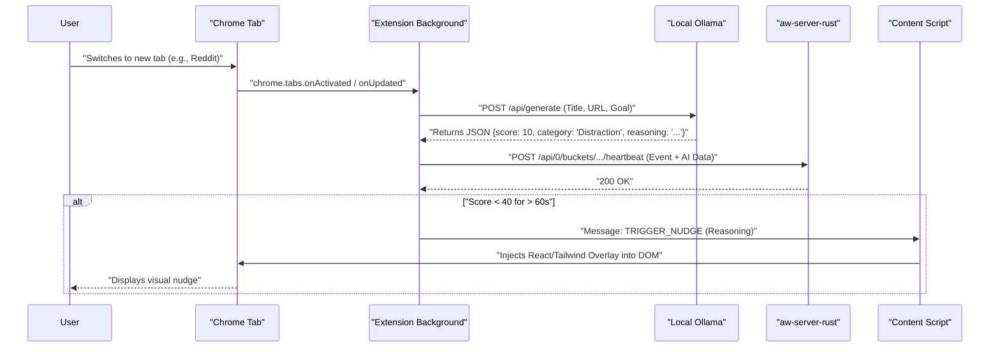

# Lighthouse: The AI-Powered Web Productivity Companion

## 1. Project Identity
**Project Name:** Lighthouse  
**Tagline:** Your privacy-first, local AI focus coach. Stop analyzing past distractions; start preventing them in real-time.  

**Problem Statement:**  
1. **The Session Autopsy Problem:** Existing time trackers (like RescueTime or basic ActivityWatch) provide retrospective guilt—showing you *after* the fact that you wasted 3 hours on YouTube.  
2. **The Domain Classification Fallacy:** Static blocklists fail because context matters. YouTube can be productive (learning React) or a distraction (watching cat videos).  
3. **The Privacy vs. Intelligence Dilemma:** Cloud-based AI assistants require sending your entire browsing history and screen data to external servers, violating user trust.

## 2. Product Vision
**What it is:** Lighthouse is an intelligent, HeyClicky-inspired web companion built on top of the ActivityWatch open-source infrastructure. It operates directly in your browser, using local AI to understand the *context* of your browsing, proactively nudge you away from distractions, and synthesize your work sessions into actionable insights.

**How it's different:**  
- **Proactive, not Passive:** Instead of charts at the end of the day, Lighthouse provides gentle, real-time overlays and side-panel interactions when you stray off-task.  
- **Context-Aware, not Domain-Aware:** Uses on-device LLMs (Ollama with Llama 3 / Phi-3) to analyze page titles and URLs dynamically to determine intent based on a user's *current goal*.  
- **Zero-Cloud Privacy:** Built on ActivityWatch's local SQLite architecture and local AI. No data leaves your machine.  

**Key User Personas:**  
- **The ADHD knowledge worker:** Needs gentle guardrails, quick context resets, and immediate feedback to maintain flow.  
- **The privacy-conscious developer:** Wants intelligent analytics but refuses to use invasive cloud surveillance tools.  

**Core User Journeys:**  
- **The Gentle Nudge:** User starts reading HackerNews during a designated "Deep Work" sprint. Lighthouse smoothly slides in a visual overlay: "Taking a break, or did we get distracted? You have 25 mins left in your Deep Work block."  
- **The Context Reset:** User gets lost in a 30-tab sprawl. Opening the Chrome Side Panel provides an AI summary of what they were *actually* trying to do, suggesting closing irrelevant tabs.
- **The Standup Generator:** User finishes the day. Lighthouse synthesizes all ActivityWatch events and outputs: "Drafting your standup notes based on today's PR reviews and Slack discussions..."

## 3. Competitive Differentiation

| Feature | Lighthouse | RescueTime | ActivityWatch (Base) | HeyClicky |
| :--- | :--- | :--- | :--- | :--- |
| **Real-time Nudges** | ✅ Yes (DOM overlays) | ❌ No (Retrospective) | ❌ No (Passive) | ✅ Yes |
| **Context-Aware AI** | ✅ Yes (Dynamic intent) | ❌ No (Static categories) | ❌ No | ✅ Yes |
| **Privacy Strategy** | ✅ 100% Local (Zero Cloud) | ❌ Cloud-dependent | ✅ 100% Local | ❌ Cloud / API dependent |
| **UX Paradigm** | Gentle, Side-panel/Overlay | Guilt-driven dashboards | Developer-focused | OS-level Notch |
| **Actionable Outputs**| ✅ Session receipts, standups | ❌ Just charts | ❌ Just raw data | ✅ Yes |

## 4. Feature Specification

### P0 (MVP / Hackathon Demo) - Must Have
- **Enhanced Web Watcher:** Chrome MV3 extension tracking active URL, title, and audible state, feeding local aw-server. Uses Offscreen Document for keep-alive.
- **Chrome Side Panel UI:** A persistent side panel for setting current goals, viewing real-time focus score, and reading session summaries.
- **Local AI Context Classification:** Real-time evaluation of page titles/URLs using Ollama (Llama 3/Phi-3) to determine productivity score (0-100) and category based on declared user intent.
- **Proactive Overlays:** Non-punitive, Tailwind-styled visual nudges injected into the DOM when distraction is detected (AI score < 40 for > 60s).
- **Pulse Dashboard:** A beautiful React-based dashboard showing Active Time vs. Distraction Time, and context switches.

### P1 (Enhanced) - Nice to Have
- **Session Receipts:** AI-generated summaries of completed deep-work sessions (e.g., "Standup Generator").
- **Voice Nudges:** Clicky-inspired voice TTS saying "Focus back on VS Code" (using local web speech API).
- **Tab Sprawl Amnesia Fix:** Auto-grouping or discarding tabs based on AI task classification.

### P2 (Future) - Post-Hackathon
- **Mac-Native Desktop Integration:** Full screen-awareness like HeyClicky (ScreenCaptureKit).
- **Multi-Agent Workspace:** Custom avatars for different tasks (e.g., "Research Agent", "Coding Agent").
- **Burnout Detection:** Analyzing switch-rates to detect fatigue and suggest breaks.

## 5. Technical Architecture

### System Architecture Diagram



### Event Flow Sequence Diagram



### Component Breakdown
1. **Chrome Extension:**
   - **Background Worker:** Orchestrates tab tracking, handles the double-heartbeat pattern for AW, calls the local LLM API for scoring, and manages state (current goal, timers).
   - **Offscreen Document:** Ensures the background worker doesn't sleep, critical for continuous tracking.
   - **Content Script:** Injects React/Tailwind components into the current page DOM using Shadow DOM to prevent style conflicts for nudges.
   - **Side Panel & Popup:** React applications for user interaction (setting goals, viewing status).
2. **AI Intelligence Layer:** Uses Ollama (`http://localhost:11434/api/generate`) with a lightweight model (e.g., `llama3` or `phi3`) to classify `[Title, URL]` against the user's current goal, returning a structured JSON response (score, category, reasoning).
3. **Pulse Backend:** FastAPI server that queries the AW SQLite DB or its REST API, running AWQ (ActivityWatch Query) scripts to calculate complex metrics (Context Switches, True Active Time, Focus Trends).
4. **Frontend Dashboard:** A Next.js/Vite React app using `shadcn/ui` and `recharts` for viewing trends and generating the "Standup Notes" by calling the LLM with aggregated session data.

## 6. Data Models & API Design

### TypeScript Interfaces

```typescript
// Extension State
interface AppState {
  currentGoal: string | null;
  sessionStartTime: number | null;
  currentFocusScore: number;
  recentDistractions: DistractionEvent[];
}

interface DistractionEvent {
  timestamp: number;
  url: string;
  durationSeconds: number;
}

// ActivityWatch Event Payload
interface LighthouseAWEvent {
  timestamp: string; // ISO 8601
  duration: number;
  data: {
    url: string;
    title: string;
    audible: boolean;
    incognito: boolean;
    tabCount: number;
    goal_active: string | null;
    ai_score: number; // 0-100
    ai_category: string;
    ai_reasoning: string;
  };
}

// LLM Response Format
interface LLMClassificationResult {
  score: number;      // 0-100
  category: string;   // Single word (e.g., "Research", "Distraction", "Coding")
  reasoning: string;  // Short sentence explaining the score
}

// Pulse Backend API Responses
interface DailySummaryResponse {
  date: string;
  totalActiveSeconds: number;
  averageFocusScore: number;
  topCategories: Record<string, number>;
  contextSwitches: number;
}

interface StandupNotesResponse {
  markdown: string;
}
```

### Pulse Backend API Endpoints (FastAPI)

- `GET /api/summary?date=YYYY-MM-DD`: Returns `DailySummaryResponse`.
- `GET /api/timeline?date=YYYY-MM-DD`: Returns array of events with timestamps, scores, and categories for charting.
- `POST /api/generate-standup`: 
  - Body: `{ date: "YYYY-MM-DD" }`
  - Returns: `StandupNotesResponse` (Aggregates day's events, sends to Ollama, returns markdown).

## 7. Project Structure

```text
lighthouse/
├── README.md
├── docker-compose.yml        # For local Ollama setup if needed
├── extension/                # Chrome Extension (React + Vite + CRXJS)
│   ├── manifest.json
│   ├── vite.config.ts
│   ├── package.json
│   ├── src/
│   │   ├── background/
│   │   │   ├── index.ts      # Main SW entry
│   │   │   ├── aw-client.ts  # ActivityWatch REST integration
│   │   │   ├── llm-client.ts # Ollama integration
│   │   │   └── state.ts      # In-memory state management
│   │   ├── content/
│   │   │   ├── index.tsx     # Injects React tree into DOM via Shadow DOM
│   │   │   ├── Overlay.tsx   # The nudge component
│   │   │   └── styles.css    # Tailwind output for content script
│   │   ├── sidepanel/
│   │   │   ├── index.html
│   │   │   ├── main.tsx
│   │   │   └── App.tsx       # Side panel UI
│   │   ├── popup/
│   │   │   ├── index.html
│   │   │   ├── main.tsx
│   │   │   └── App.tsx       # Quick goal setting UI
│   │   ├── offscreen/
│   │   │   ├── index.html
│   │   │   └── keepalive.js
│   │   ├── shared/
│   │   │   ├── types.ts      # TypeScript interfaces
│   │   │   └── messages.ts   # Message passing constants & types
│   │   └── assets/
├── pulse-backend/            # Analysis Server (FastAPI)
│   ├── main.py               # API routes
│   ├── aw_queries.py         # AWQ logic and data fetching
│   ├── llm_service.py        # Prompts for standup generation
│   ├── models.py             # Pydantic models
│   └── requirements.txt
└── dashboard/                # Main Web UI (React + Vite)
    ├── package.json
    ├── vite.config.ts
    ├── src/
    │   ├── components/       # shadcn/ui components
    │   ├── features/
    │   │   ├── TimelineChart.tsx
    │   │   ├── CategoryBreakdown.tsx
    │   │   └── StandupGenerator.tsx
    │   ├── lib/
    │   │   └── api.ts        # Axios client for pulse-backend
    │   ├── App.tsx
    │   └── main.tsx
```

## 8. Implementation Roadmap (Task-Level Granularity)

- **Phase 1: Foundation & Infrastructure (Hours 0-3)**
  - Task 1.1: Start `aw-server-rust` and ensure Ollama (`llama3` or `phi3`) is running locally.
  - Task 1.2: Initialize `extension` with Vite + CRXJS. Setup manifest with permissions (`tabs`, `storage`, `sidePanel`, `offscreen`, `scripting`).
  - Task 1.3: Implement background script offscreen keep-alive logic.
  - Task 1.4: Implement `aw-client.ts` to create the `aw-watcher-web-lighthouse` bucket and implement the double-heartbeat function.

- **Phase 2: Core Intelligence & Tracking (Hours 3-7)**
  - Task 2.1: Implement tab listener in background script to detect URL/Title changes.
  - Task 2.2: Implement `llm-client.ts` to call Ollama. Write the JSON-enforced classification prompt with few-shot examples.
  - Task 2.3: Wire tab changes -> LLM classification -> AW heartbeat.
  - Task 2.4: Build Popup UI to set `currentGoal` in chrome.storage.

- **Phase 3: UX, Nudges, & Side Panel (Hours 7-12)**
  - Task 3.1: Build the Side Panel UI showing current goal, timer, and a real-time focus score gauge.
  - Task 3.2: Implement distraction detection logic in background (score < 40 for > 60s).
  - Task 3.3: Build `content/index.tsx` and `Overlay.tsx`. Use Framer Motion for smooth slide-in animations mounted in a Shadow DOM.
  - Task 3.4: Wire background script to send message to content script to trigger the overlay. Add "Dismiss" and "Back to Work" buttons.

- **Phase 4: Dashboard & Insights (Hours 12-18)**
  - Task 4.1: Scaffold `pulse-backend` FastAPI server. Implement basic read from AW REST API.
  - Task 4.2: Implement `/api/summary` and `/api/timeline` endpoints using Pydantic models.
  - Task 4.3: Scaffold `dashboard` React app. Implement Recharts timeline and metrics cards.
  - Task 4.4: Implement `/api/generate-standup` endpoint in Python, pulling daily events and prompting LLM. Build UI button to trigger and display markdown.

- **Phase 5: Polish & Demo Prep (Hours 18-24)**
  - Task 5.1: Refine LLM prompts to reduce latency (ensure streaming or JSON mode).
  - Task 5.2: UI polish using `shadcn/ui` with clean typography and layout specs.
  - Task 5.3: Rehearse and record demo.

## 9. Hackathon Demo Script (60-Second "Aha!" Flow)

1. **[0:00 - 0:10] The Setup:** Open the Chrome Side Panel. Type in the goal: "Building a React dashboard for the hackathon." Click "Start Session".
2. **[0:10 - 0:25] Productive Work:** Switch to a tab with VS Code Web or Github. Show the Side Panel instantly updating: Focus Score 95%, Category: "Coding". The LLM reasoning shows: "Relevant to React dashboard."
3. **[0:25 - 0:40] The Distraction:** Open a new tab and go to Reddit (e.g., r/funny). Wait ~5 seconds (shortened for demo purposes).
4. **[0:40 - 0:45] The Nudge:** A beautifully styled, smooth overlay slides in from the bottom right: *"Taking a break? Reddit doesn't align with 'Building a React dashboard'. (Score: 10/100)."*
5. **[0:45 - 0:60] The Payoff (Standup):** Open the local Pulse Dashboard. Click "Generate Standup". The screen types out a Markdown summary: *"Today, you spent 2 hours focused on the React dashboard. You reviewed 3 GitHub PRs and spent 10 minutes on Reddit. Tomorrow, you should..."* Emphasize: *No data left the machine.*

## 10. Prerequisites, Setup & Configuration

### Prerequisites
- **Node.js**: v18+ (for React/Vite development)
- **Python**: 3.10+ (for FastAPI backend)
- **Ollama**: Installed and running locally
- **ActivityWatch**: `aw-server-rust` installed and running locally
- **Chrome/Brave**: Latest version for testing the MV3 extension

### Environment Setup Commands

**1. Ollama Setup:**
```bash
# Install Ollama (https://ollama.com/download)
# Pull the required models
ollama pull llama3
ollama pull phi3
```
*Verification:* Run `curl http://localhost:11434/api/tags` and ensure it returns 200 OK.

**2. ActivityWatch Setup:**
```bash
# Download and run aw-server-rust (https://activitywatch.net/downloads/)
./aw-server
```
*Verification:* Navigate to `http://localhost:5600` to see the ActivityWatch dashboard.

**3. Frontend / Extension Setup:**
```bash
cd lighthouse/extension
npm install
npm run build
```
*To load in Chrome:*
1. Go to `chrome://extensions/`
2. Enable "Developer mode"
3. Click "Load unpacked" and select the `lighthouse/extension/dist` folder.

**4. Backend Setup:**
```bash
cd lighthouse/pulse-backend
python -m venv venv
source venv/bin/activate
pip install -r requirements.txt
uvicorn main:app --reload --port 8000
```
*Verification:* Navigate to `http://localhost:8000/docs` for the Swagger UI.

**5. Dashboard Setup:**
```bash
cd lighthouse/dashboard
npm install
npm run dev
```
*Verification:* Navigate to `http://localhost:3000`.

### Configuration & Environment Variables

**Extension (`extension/.env`):**
```env
VITE_OLLAMA_URL=http://localhost:11434
VITE_AW_URL=http://localhost:5600
VITE_LLM_MODEL=phi3
```

**Backend (`pulse-backend/.env`):**
```env
AW_SERVER_URL=http://localhost:5600
OLLAMA_URL=http://localhost:11434
LLM_MODEL=llama3
```

## 11. Risks & Mitigations

| Risk | Impact | Mitigation |
| :--- | :--- | :--- |
| **LLM Latency** | High (delays tracking & nudges) | Use smaller models (`phi3`), optimize prompts for short JSON responses, and process tab updates asynchronously without blocking the UI. |
| **Extension Sleeping** | High (stops tracking) | Chrome MV3 aggressively sleeps background workers. Implemented the "Offscreen Document" pattern to maintain a constant keep-alive ping. |
| **Shadow DOM Styling** | Medium (ugly nudges) | Inject Tailwind CSS explicitly into the Shadow DOM root in the content script to ensure styles are isolated and applied correctly. |
| **AW DB Locks** | Low (missing data) | Use `aw-client` with appropriate retry logic and batching to prevent overwhelming the local SQLite database. |

## 12. Judging Criteria Alignment

- **Innovation & Originality:** Shifts time-tracking from *retrospective guilt* to *proactive coaching* using local context.
- **Technical Complexity:** Orchestrates a Chrome extension, a local Rust server (AW), an on-device LLM (Ollama), and a Python/React analytics dashboard simultaneously.
- **Privacy First:** 100% local operation answers the growing concern over AI assistants sending sensitive screen/browser data to the cloud.
- **Polish & Design:** Employs Tailwind, Framer Motion, and shadcn/ui to deliver a consumer-grade, non-punitive user experience.

---

## 13. FULL COMPREHENSIVE DEVELOPMENT PROMPT

Copy and paste the following prompt into your AI development assistant to generate the entire project:

```text
You are an expert full-stack developer. Build "Lighthouse", a privacy-first, local AI web productivity companion. 
The system consists of three parts: a Chrome MV3 Extension, a FastAPI Analytics Backend, and a React Dashboard. 
All data stays local, integrating with `aw-server-rust` and `Ollama`.

Here is the complete project structure and specifications:

### 1. Project Structure
lighthouse/
├── docker-compose.yml
├── extension/
│   ├── manifest.json
│   ├── vite.config.ts
│   ├── package.json
│   ├── src/
│   │   ├── background/index.ts, aw-client.ts, llm-client.ts, state.ts
│   │   ├── content/index.tsx, Overlay.tsx, styles.css
│   │   ├── sidepanel/index.html, main.tsx, App.tsx
│   │   ├── popup/index.html, main.tsx, App.tsx
│   │   ├── offscreen/index.html, keepalive.js
│   │   ├── shared/types.ts, messages.ts
├── pulse-backend/
│   ├── main.py, aw_queries.py, llm_service.py, models.py, requirements.txt
└── dashboard/
    ├── package.json, vite.config.ts
    ├── src/components/, features/, lib/api.ts, App.tsx, main.tsx

### 2. Chrome Extension (React + Vite + CRXJS)
- **Manifest.json:** Use MV3. Include permissions: `tabs`, `storage`, `sidePanel`, `offscreen`, `scripting`, `activeTab`. Host permissions for `http://localhost:11434/*` and `http://localhost:5600/*`.
- **Background Worker:** 
  - Manage state (current goal, focus score). 
  - Listen to `chrome.tabs.onActivated` and `onUpdated`. 
  - Call Ollama API (`/api/generate`) with a structured prompt to classify intent.
  - Send heartbeats to AW (`/api/0/buckets/aw-watcher-web-lighthouse/heartbeat`).
- **Offscreen Document:** Implement a 20-second interval ping to keep the service worker alive.
- **Message Passing Protocol (`shared/messages.ts`):** 
  - `SET_GOAL` (Popup -> Background)
  - `GET_STATE` (UI -> Background)
  - `TRIGGER_NUDGE` (Background -> Content Script)
- **Content Script:** Use React and Tailwind. Mount the `Overlay.tsx` inside a Shadow DOM to isolate styles. The overlay should slide in from the bottom right using Framer Motion when `TRIGGER_NUDGE` is received (triggered if focus score < 40 for > 60s).
- **Ollama Prompt:**
  "System: You are an intent classifier. Given a user's Goal, current URL, and Page Title, return ONLY valid JSON: {\"score\": 0-100, \"category\": \"SingleWord\", \"reasoning\": \"Short sentence\"}. 
  Goal: {goal}
  URL: {url}
  Title: {title}"

### 3. Pulse Backend (FastAPI)
- **CORS:** Enable `allow_origins=["*"]` for local dev.
- **Models (`models.py`):**
  - `DailySummaryResponse`: date (str), totalActiveSeconds (int), averageFocusScore (float), topCategories (dict), contextSwitches (int).
  - `StandupNotesResponse`: markdown (str).
- **Routes (`main.py`):**
  - `GET /api/summary?date=YYYY-MM-DD`: Fetch events from `aw-server` REST API, calculate metrics.
  - `POST /api/generate-standup`: Fetch day's events, format as a prompt, send to Ollama to generate markdown notes.
- **Error Handling:** Catch connection errors to AW or Ollama and return 503 HTTP status with clear messages.

### 4. Dashboard & UI Specs (React)
- **UI Framework:** Vite + React + Tailwind CSS + shadcn/ui.
- **Color Scheme:** Slate/Zinc base with Indigo (productive) and Rose (distraction) accents. Typography: Inter.
- **Dashboard Features:** 
  - A timeline chart (using `recharts`) showing focus score over the day.
  - A button to trigger `/api/generate-standup` and a markdown renderer (`react-markdown`) to display the result.

### 5. Testing Checklist
- [ ] Extension loads unpacked without errors.
- [ ] Changing tabs updates the background state.
- [ ] Setting a goal updates local storage.
- [ ] Ollama returns valid JSON parsing correctly.
- [ ] Content script overlay successfully injects into Shadow DOM.
- [ ] ActivityWatch receives valid events in the `aw-watcher-web-lighthouse` bucket.

Generate the code for all of these files exactly as specified.
```
