<p align="center">
  
</p>

<h1 align="center">Sheru</h1>

<p align="center">
  <b>Your lion-cub focus buddy for macOS: private, on-device, a little bit cheeky.</b><br>
  Sheru knows your goals, notices when you drift, and brings you back with kindness, humour and a line from Swami Vivekananda.
</p>

<p align="center">
  
  
  
  
  
</p>

<p align="center">
  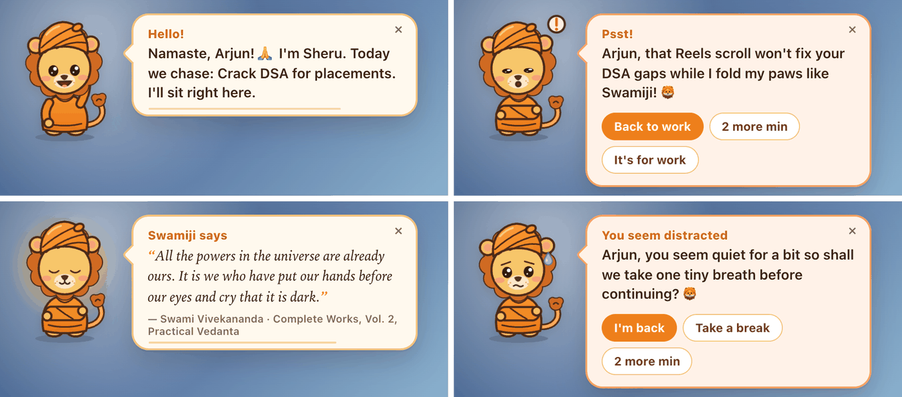
</p>

---

## Table of contents

1. [Overview](#overview)
2. [Features](#features)
3. [Quick start](#quick-start)
4. [Using Sheru](#using-sheru)
5. [Settings](#settings)
6. [How distraction detection works](#how-distraction-detection-works)
7. [Showcase script (60 seconds)](#showcase-script-60-seconds)
8. [Configuration](#configuration)
9. [Command reference](#command-reference)
10. [Architecture](#architecture)
11. [API reference](#api-reference)
12. [Project structure](#project-structure)
13. [Privacy, security and permissions](#privacy-security-and-permissions)
14. [Development](#development)
15. [Troubleshooting](#troubleshooting)
16. [FAQ](#faq)
17. [Roadmap, business plan, license and credits](#roadmap)

---

## Overview

**Sheru** is a local focus coach with a face: a lion cub in a saffron turban who sits in the top-left corner of your screen. During a one-minute onboarding you tell him your name, your goals, where your work happens and what usually pulls you away. From then on he:

- **watches the whole computer**: the app in front, its window title, your browser tab and your typing rhythm (*when* you type, never *what*);
- **judges each activity against your goals**: with rules first and a local LLM for the ambiguous cases (a YouTube DSA tutorial is work; a cat compilation is not);
- **speaks up gently** when you drift, stall in a document or hop between apps, in a friendly speech bubble that never flashes;
- **fills quiet moments** with cited quotes from Swami Vivekananda and facts about his life.

> *"Come up, O lions, and shake off the delusion that you are sheep."* (Swami Vivekananda, Chicago, 1893)
>
> Sheru grew up on Swamiji's parable of the lion cub raised among sheep. When you wander into a feed, he reminds you that you're a lion.

Everything (the model, the coach, your profile and history) runs and stays on your machine.

## Features

| Area | What you get |
|---|---|
| **Desktop buddy** | Native macOS app: transparent, always on top, on every Space; eyes follow your cursor; blinks, waves, naps when you're away, sips chai on breaks; click for a menu, drag anywhere; 🦁 menu-bar item. Clicks pass through everywhere except Sheru and his bubble. |
| **Smart detection** | A gentle **"Wrong tab?"** heads-up within seconds of landing on an off-goal tab or app (with Sheru's reasoning), writing-stall detector (two soft nudges, then "you seem distracted"), detour alerts with escalation, app-hopping detection, away/screen-lock awareness, focus-streak celebrations. |
| **Goal-aware judgement** | Your "it's for work" choices → onboarding chips → built-in rules for ~200 common apps and sites → local LLM for ambiguous titles (cached). |
| **Sheru's words** | A custom Ollama model (`sheru`, a persona Modelfile on top of `qwen3.5:4b`) writes short, personal lines and answers chat in the personality you pick (gentle, playful or coach); instant template fallbacks when the model is off. |
| **Natural voice** | Sheru speaks with a natural neural voice generated on your Mac (Kokoro-82M, 10 voices to choose from), with a playful "cub" pitch, lip-synced mouth and pre-rendered lines so he answers without delay. Falls back to the macOS voice if the model isn't installed. |
| **Settings tab** | Pace presets plus fine-tuning of every timing, on/off switches for each detector, voice, speed, pitch and volume with preview, personality, quote frequency, local-AI switch, the "always treated as work" list, and data controls. |
| **Vivekananda content** | 24 quotes cited to *The Complete Works*, 16 facts (Chicago 1893, the Tata–IISc letter, Tesla, Kanyakumari…). Misattributed internet quotes are deliberately excluded. |
| **Onboarding** | Three short steps: name and age · goals and work tools · distractions, nudge pace and quote frequency. Editable any time. |
| **Browser extension** | Reports the active tab, shows the friendly alert inside the page when the desktop app is off, and has a popup with goals, live status and today's numbers; side panel with focus sessions, tab grouping and an extension manager. |
| **Dashboard** | Live Sheru panel (status, goals, pace switch, connections, recent nudges), metrics, focus timeline, category breakdown, AI-written standup notes. |
| **One-command launch** | `./start.sh` (or double-click `Sheru.command`) sets up, starts every service, puts Sheru on the desktop and opens a browser with the extension already installed. |

### Screenshots

| Onboarding (step 2 of 3) | Onboarding (step 3 of 3) |
|---|---|
| 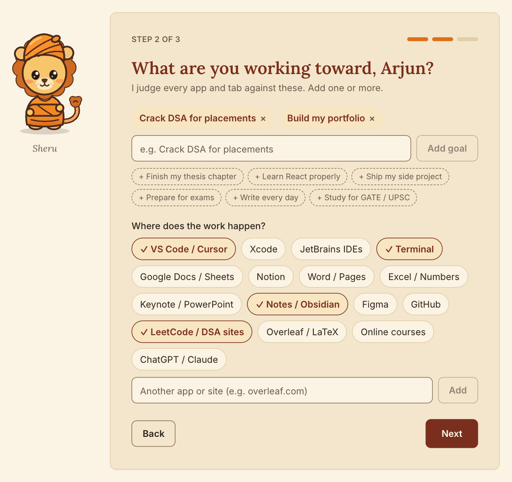 | 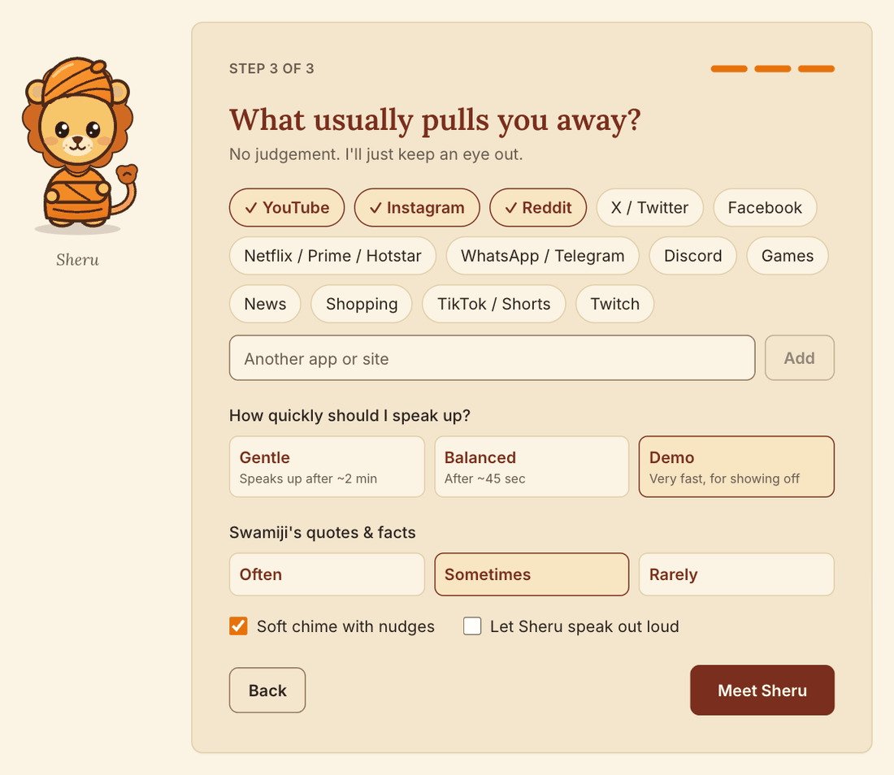 |

| Settings: nudges | Settings: voice |
|---|---|
| 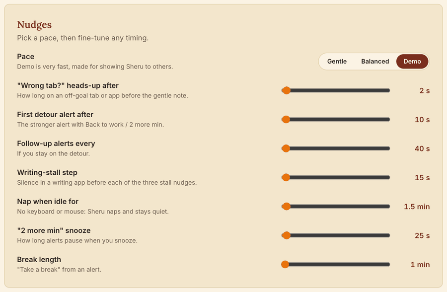 | 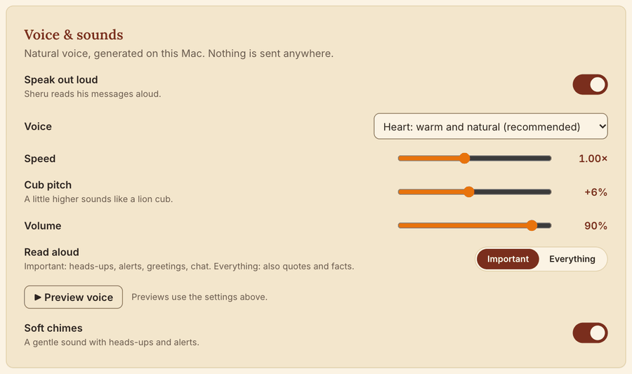 |

| Dashboard with the live Sheru panel |
|---|
| 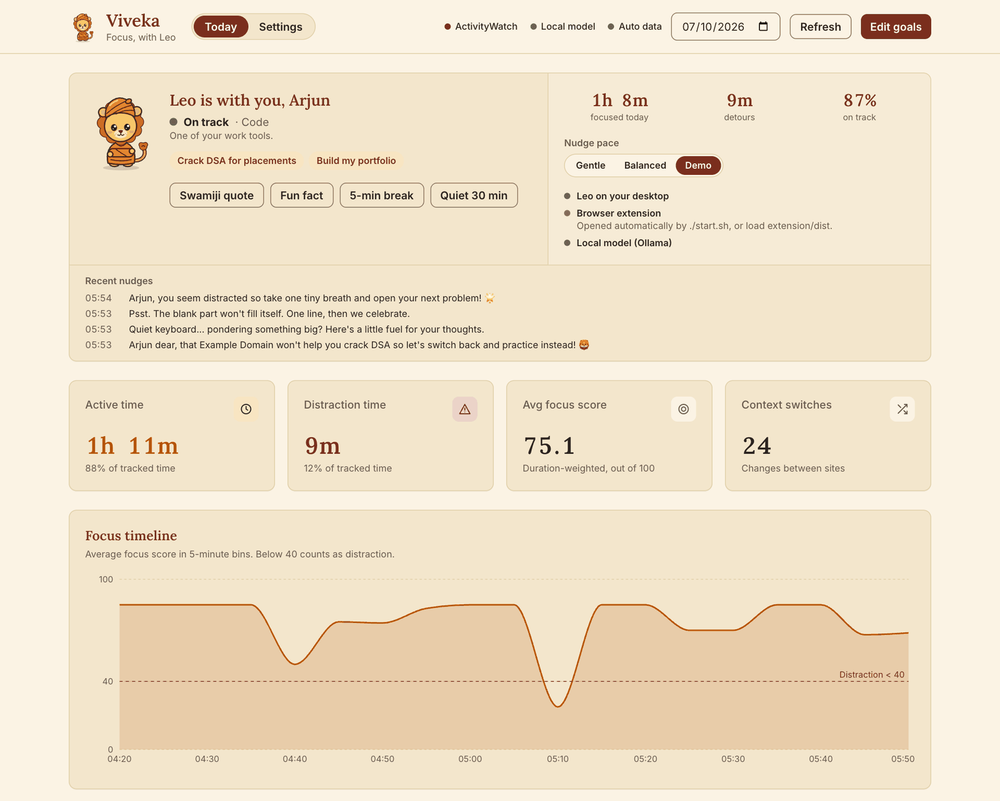 |

| Extension popup | Click Sheru for the menu |
|---|---|
| 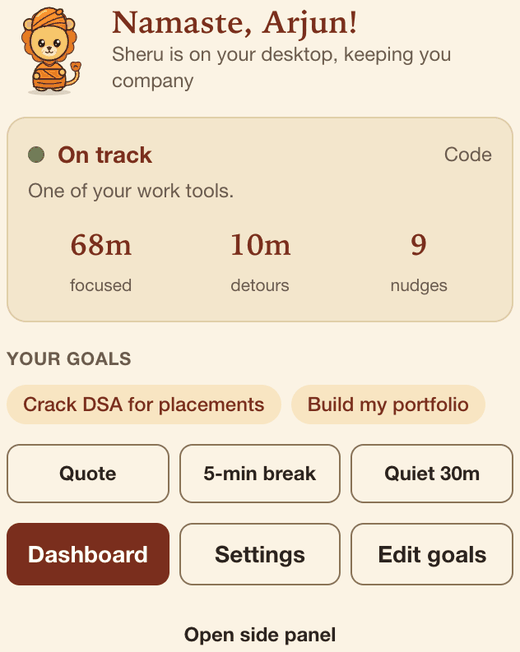 | 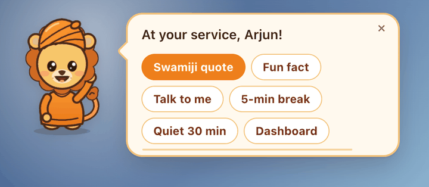 |

| Alert inside a web page (when the desktop app is off) |
|---|
| 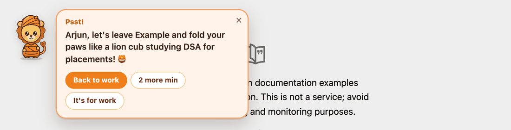 |

---

## Quick start

### Requirements

| Requirement | Version | Needed for | Install |
|---|---|---|---|
| macOS | 13 Ventura or newer | Sheru's desktop app | n/a |
| Xcode Command Line Tools | any recent | building the desktop app (`swiftc`) | `xcode-select --install` |
| Node.js | ^20.19 or ≥ 22.12 | extension and dashboard | `brew install node` or [nodejs.org](https://nodejs.org) |
| Python | ≥ 3.10 (or [`uv`](https://docs.astral.sh/uv/)) | backend | `brew install uv` (recommended) |
| Chrome, Brave or Edge | recent (tested: Chrome 154, Brave 152) | the browser window with the extension | n/a |
| Ollama | latest | *optional:* personalised lines, smart judging, chat, standups | `brew install ollama` or [ollama.com](https://ollama.com/download) |
| ActivityWatch | latest | *optional:* extra timeline source | [activitywatch.net](https://activitywatch.net) |

Disk: about 3.5 GB for the default model (`qwen3.5:4b`). Without Ollama everything still works with rule-based judging and template lines.

### Start it in 6 steps

**1. Get the code**

```bash
git clone https://github.com/saksham-eng560/sheru.git
cd sheru
```

**2. (Recommended) Start Ollama**: open the Ollama app, or run `ollama serve` in another terminal. `./start.sh` also starts it for you if it is installed.

**3. Launch everything**

```bash
./start.sh
```

Or double-click **`Sheru.command`** in Finder. The first run installs everything automatically (`./setup.sh`: npm and Python dependencies, the model, the `sheru` persona model, Sheru's natural voice, the extension build and the desktop app), which takes a few minutes, mostly the model downloads. When it finishes you will see:

```
| Sheru is running
| Sheru     : on your desktop (top-left corner; 🦁 in the menu bar)
| Browser   : open, extension installed (chrome)
| Dashboard : http://localhost:3000   (onboarding opens there on first run)
| Sheru model: ready (ollama model 'sheru')
| Voice     : natural voice (on-device); switch it on in Settings > Voice
| Settings  : http://localhost:3000/?view=settings
```

**4. Onboard (about 30 seconds)** in the browser window that opened: your name, your goals, your work apps and sites, your usual distractions, and a nudge pace. Choose **Demo** if you are showing it to someone.

**5. Allow window titles (once).** macOS may ask to give your Terminal app **Accessibility** access. This lets Sheru read window titles (for example, which document or video is open). It is optional: without it he still sees app names, browser tabs and typing rhythm.

**6. Make him yours.** Open **Settings** (dashboard tab, 🦁 menu → *Settings…*, or the extension popup): switch on **Speak out loud**, pick a voice and press **Preview voice**, choose a personality, and fine-tune any timing. Then work: Sheru greets you by name and keeps you company. Click him for quotes, facts, chat or a break.

**To stop:** press **Ctrl+C** in the terminal (or close the `Sheru.command` window). If you started with `./start.sh --detach`, run `./stop.sh`.

### Ports and files

| What | Where |
|---|---|
| Dashboard | http://localhost:3000 |
| Backend / API docs | http://localhost:8000 · http://localhost:8000/docs |
| Sheru's UI (preview in any browser) | http://localhost:8000/buddy/ |
| Ollama · ActivityWatch | `:11434` · `:5600` |
| Your profile, settings and history | `.data/profile.json`, `.data/sheru.db` |
| Natural-voice model | `.models/` (~205 MB, downloaded once) |
| Logs and process files | `.run/logs/*.log`, `.run/*.pid` |
| Sheru browser profile | `.run/browser-profile/` |
| Desktop app build | `buddy/build/Sheru.app` |

### Update, reset, uninstall

```bash
git pull && ./setup.sh && ./start.sh   # update (setup re-installs changed dependencies)
./start.sh --fresh                     # run onboarding again (history is kept)
./stop.sh && rm -rf .data              # forget your profile and history
./stop.sh && rm -rf .data .run .models buddy/build && ollama rm sheru   # remove everything Sheru created
```

---

## Using Sheru

**Sheru on the desktop.** He lives in the top-left corner. Hover to see what he thinks of the current app (`✓ LeetCode`), click for the menu (*Swamiji quote · Fun fact · Talk to me · 5-min break · Quiet 30 min · Dashboard*), or drag him anywhere; the position is remembered. The 🦁 menu-bar item can show or hide him, reset his position, quiet him, open the dashboard or edit goals.

**Alerts.** First a soft **"Wrong tab?"** heads-up (it fades on its own and disappears the moment you switch back), then, if you stay, a speech bubble with a short personal line and buttons. Each one shows Sheru's reasoning underneath (*"Why: Cats videos are unrelated to DSA learning."*).

| Button | Effect |
|---|---|
| **Back to work** | Brings your last work app to the front (and its tab, via the extension). |
| **2 more min** | Snoozes alerts for the pace's snooze time. |
| **It's for work** | Remembers this app or site as work from now on. |
| **Take a break** | Silences Sheru for 5 minutes (1 minute in Demo pace), then calls you back. |
| **×** / **Got it** / **I'm back** | Dismisses the alert (and snoozes when it was a distraction alert). |

**The extension.** In the browser window opened by `./start.sh` the extension is already installed. Its popup shows your goals, Sheru's view of the current tab, today's focus and detour minutes and quick actions. When the desktop app isn't running (or on Linux), Sheru's alerts appear inside the web page instead. If the backend is down, the extension falls back to its standalone engine (side-panel sessions with its own classifier).

**His voice.** Switch on *Speak out loud* in Settings. Sheru reads heads-ups, alerts, greetings and chat replies (or everything, including quotes) in a natural on-device voice, with his mouth moving as he talks; a bubble never disappears mid-sentence.

**The dashboard.** Two tabs: **Today** (live Sheru panel, metrics, timeline, standup) and **Settings**. Use *Edit goals* to change anything from onboarding. Metrics, the focus timeline and standup notes are built from Sheru's whole-computer log.

---

## Settings

Everything Sheru does is adjustable in the dashboard's **Settings** tab (also from the 🦁 menu → *Settings…* and the extension popup). Changes apply immediately; there is no save button.

| Section | What you can change |
|---|---|
| **Nudges** | Pace preset (Gentle / Balanced / Demo) and fine-tuning of each timing on top of it: "Wrong tab?" delay, first detour alert, follow-ups, writing-stall step, nap-when-idle, snooze and break length. One click resets them to the preset. |
| **What Sheru watches for** | Switch each detector on or off: wrong-tab heads-up, detour alerts, writing stalls, tab hopping, focus streaks, welcome back. |
| **Voice & sounds** | Speak out loud, voice (Heart, Puck, Bella, Michael, Fenrir, Nicole, Emma, George, and two experimental Indian-accent voices), speed, cub pitch, volume, what to read aloud, **Preview voice**, soft chimes. |
| **Personality & wisdom** | Gentle / Playful / Coach tone for Sheru's model-written lines and chat; Swamiji quote frequency (often to off); use of the local model; the hover status label. |
| **Always treated as work** | Everything you marked with *It's for work*, with a Remove button each. |
| **You & your data** | Edit goals and distractions, clear the activity history, or start over. |

Settings live inside your profile (`.data/profile.json`); editing goals in onboarding never resets them.

## How distraction detection works

Every second the coach (`pulse-backend/coach.py`) merges two signals:

- **Desktop** (from Sheru's app, every 2 s): the frontmost app and its window title, seconds since the last key press and since any input, and whether the screen is locked.
- **Browser** (from the extension): the active tab's URL and title, audio and window focus.

Each activity is judged against your goals in layers:

1. your own *It's for work* decisions;
2. your onboarding chips (work tools and usual distractions);
3. built-in rules for editors, terminals, docs, coding-practice sites, feeds, streaming, games, shopping and more;
4. for ambiguous cases (YouTube, an unknown site or app) the **local model** decides from the title, cached per title. Until it answers, a keyword heuristic is used, so judging is always instant.

Then four detectors run, timed by your **pace**:

| Detector | Trigger | What Sheru does |
|---|---|---|
| **Wrong-tab heads-up** | You land on an off-goal tab or app | A few seconds later, a soft, self-dismissing note: *"Hmm, Instagram? I don't think that's the right tab for 'Crack DSA for placements', Arjun. Shall we switch back?"* plus the reason. No alarm sound, no sticky alert; it vanishes when you go back. For ambiguous sites (YouTube) Sheru first waits briefly for the model's verdict, so tutorials aren't flagged. |
| **Writing stall** | You were typing in a writing context (editor, doc, notes, LeetCode…) and stopped | Nudge 1: *"Thinking pause?"* plus a quote as fuel → nudge 2: *"Still stuck? Try the messiest first line"* → step 3: **"You seem distracted"**, a persistent alert with *I'm back / Take a break / 2 more min*. Typing again clears it with a cheer. |
| **Detour** | An off-goal app or site stays in front | A playful alert, then a firmer (still funny) one if you stay. Coming back to work is celebrated. |
| **Hopping** | Many app or site switches in a short window | *"Pick just one thing for the next 10 minutes?"* |
| **Quiet moments** | You're not typing and not distracted | A Vivekananda quote or fact. |

| Timing | Demo | Balanced | Gentle |
|---|---|---|---|
| Wrong-tab heads-up (same site again after) | 2 s (40 s) | 4 s (3 min) | 12 s (10 min) |
| Detour: first alert / follow-ups | 10 s / 40 s | 45 s / 5 min | 2 min / 10 min |
| Writing stall: each step | 15 s | 90 s | 3 min |
| Away (Sheru naps) | 90 s idle | 5 min idle | 5 min idle |
| Snooze ("2 more min") | 25 s | 3 min | 5 min |
| Hopping | 6 switches / 40 s | 8 switches / 2 min | 10 switches / 2 min |
| Focus-streak celebration | 3 min | 25 min | 45 min |
| Quote or fact (× 0.5 *often*, × 2.5 *rarely*) | 75 s | 12 min | 25 min |

When you're away or the screen is locked, Sheru naps and never nudges, then welcomes you back. Breaks and *Quiet 30 min* silence all alerts.

<p align="center">
  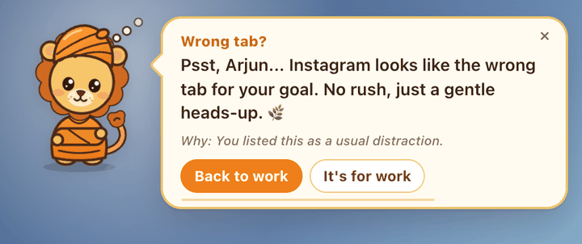
</p>

<p align="center">
  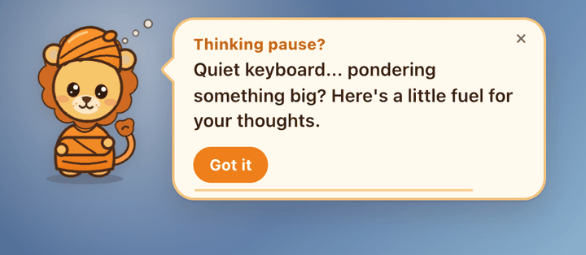
  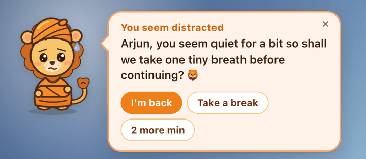
</p>

---

## Showcase script (60 seconds)

1. `./start.sh --fresh` (or double-click `Sheru.command`). The browser opens onboarding and Sheru waves from the top-left.
2. Onboard: a name, the goal *Crack DSA for placements*, tick *VS Code* and *LeetCode*, keep *YouTube*/*Instagram*, choose **Demo**. Sheru greets you by name and shares *"Arise, awake…"*.
3. **Writing stall:** in your editor or a doc, type a line and stop. About 15 s later comes *"Thinking pause?"* plus a quote; at 30 s *"Still stuck?"*; at 45 s **"You seem distracted"**. Type a word and Sheru cheers.
4. **Wrong tab:** open Instagram or a funny YouTube video. Within a few seconds Sheru gently asks *"Wrong tab?"* and shows why he thinks so. Switch back and the note disappears. Stay, and at about 10 s a playful alert follows; click **Back to work** and your editor comes back to the front.
5. Click Sheru → **Swamiji quote**, **Fun fact**, **Talk to me** (*"Who was Narendranath?"*). With **Speak out loud** on (Settings → Voice), he says it all in his natural voice.
6. Show the dashboard: live status, recent nudges and the day's timeline from Sheru's log.

---

## Configuration

Defaults work out of the box. To customise, copy the relevant part of [`.env.example`](.env.example) into `pulse-backend/.env`, `dashboard/.env` or `extension/.env` (`./setup.sh --with-env` does this).

### Backend (`pulse-backend/.env`)

| Variable | Default | Description |
|---|---|---|
| `SHERU_DATA_DIR` | `<repo>/.data` | Where `profile.json` and `sheru.db` live (`LIGHTHOUSE_DATA_DIR` still works). |
| `SHERU_MODELS_DIR` | `<repo>/.models` | Where the natural-voice model files live. |
| `LLM_MODEL` | `qwen3.5:4b` | Base model for judging and standups. |
| `BUDDY_MODEL` | `sheru` | Model for Sheru's lines and chat; falls back to `LLM_MODEL` if missing. |
| `LLM_CLASSIFY` | `on` | `off` = rules and templates only (no background LLM calls). |
| `OLLAMA_URL` | `http://localhost:11434` | Ollama endpoint. |
| `DATA_SOURCE` | `auto` | `auto` (Sheru's log → ActivityWatch → sample data), `local`, `aw`, `sample`. |
| `STANDUP_FALLBACK` | `template` | `template` = deterministic standup when Ollama is down; `off` = HTTP 503. |
| `AW_SERVER_URL` | `http://localhost:5600` | ActivityWatch server. |
| `AW_BUCKET_PREFIX` | `aw-watcher-web-lighthouse` | ActivityWatch bucket prefix written by the extension. |
| `LLM_TIMEOUT_SECONDS` | `120` | Timeout for standup generation. |
| `COACH_TICK_SECONDS` | `1` | Coach evaluation interval. |

### Dashboard and extension

| Variable | Default | Description |
|---|---|---|
| `VITE_API_URL` (dashboard) | `http://localhost:8000` | Backend URL. |
| `VITE_BRAIN_URL` (extension) | `http://127.0.0.1:8000` | Sheru's brain (backend) URL. |
| `VITE_DASHBOARD_URL` (extension) | `http://localhost:3000` | Opened from the popup. |
| `VITE_OLLAMA_URL`, `VITE_LLM_MODEL` (extension) | `http://localhost:11434`, `qwen3.5:4b` | Standalone fallback mode only. |
| `VITE_AW_URL` (extension) | `http://localhost:5600` | ActivityWatch heartbeats. |
| `VITE_NUDGE_THRESHOLD_SECONDS` (extension) | `60` | Standalone fallback mode only. |

### Script environment

| Variable | Used by | Description |
|---|---|---|
| `SHERU_BROWSER` | `start.sh` | `chrome`, `brave`, `edge`, `chromium` or a path to a browser binary (default: first installed). |
| `BACKEND_PORT`, `DASHBOARD_PORT` | `start.sh` | Default `8000`, `3000`. |
| `LLM_MODEL` | all scripts | Model to pull and to build `sheru` on; use the same value everywhere. |
| `OLLAMA_URL`, `AW_SERVER_URL`, `AW_HOME` | `start.sh` | Remote or custom locations; see [ActivityWatch](#activitywatch-optional). |

---

## Command reference

| Command | What it does |
|---|---|
| `./start.sh` | Runs setup if needed and rebuilds a stale extension, then starts Ollama and builds `sheru`, ActivityWatch (if installed), the backend, the dashboard, Sheru's desktop app and a browser window with the extension; installs the natural voice in the background if it is missing. Runs in the foreground; Ctrl+C stops everything. |
| `./setup.sh` | Idempotent install: Node and Python checks, venv and npm dependencies, model pull, `sheru` model, natural voice (verified download), extension build, desktop app build. |
| `scripts/install-voice.sh` | Installs only the natural voice (kokoro-onnx + ~205 MB of model files, SHA-256 checked). |
| `./stop.sh` | Stops every service recorded in `.run/*.pid` (only processes that are verifiably ours). |
| `./test.sh` | Extension, dashboard and backend test suites plus a Swift type-check of the desktop app; `--build` also runs both production builds. |
| `Sheru.command` | Finder double-click wrapper around `./start.sh`. |
| `buddy/build.sh` | Builds `Sheru.app` with `swiftc`; rebuilds only when sources change (`--force` to rebuild). |

**`./start.sh` flags**

| Flag | Effect |
|---|---|
| `-d`, `--detach` | Start in the background and return; stop later with `./stop.sh`. |
| `--fresh` | Clear the saved profile so onboarding runs again (history kept). |
| `--no-buddy` | Don't start Sheru's desktop app. |
| `--no-browser` | Don't open the Sheru browser window; open the dashboard in your default browser instead. |
| `--no-voice` | Don't install the natural voice if it is missing (Sheru uses the macOS voice). |
| `--no-open` | Open no browser at all. |
| `--no-aw-watchers` / `--aw-watchers` | Control ActivityWatch's window and AFK watchers (see below). |
| `--fix-ollama [-y]` | macOS: let the extension call Ollama directly (needed only for the standalone fallback). Sets `launchctl setenv OLLAMA_ORIGINS "chrome-extension://*"` and restarts Ollama after a confirmation; undo with `launchctl unsetenv OLLAMA_ORIGINS`. |

**`./setup.sh` flags:** `--dev` (backend test dependencies), `--skip-model` (don't pull the LLM), `--skip-voice` (no natural voice), `--with-env` (create `.env` files from the examples).

### ActivityWatch (optional)

<details>
<summary>Use ActivityWatch as an additional timeline source</summary>

Sheru keeps its own log and does not need ActivityWatch. If it is installed, `./start.sh` detects `/Applications/ActivityWatch.app` (or an unpacked download in `AW_HOME`, `~/Downloads/activitywatch`, `~/activitywatch`, `/Applications/activitywatch`, `~/Applications/activitywatch`) and starts `aw-server-rust` plus the window and AFK watchers itself (the `aw-qt` tray app is not needed).

- If macOS kills the downloaded binaries (exit 137), clear the quarantine flag: `xattr -dr com.apple.quarantine ~/Downloads/activitywatch`.
- To let the extension write heartbeats, add this line to `~/Library/Application Support/activitywatch/aw-server-rust/config.toml` (a **list**, with brackets) and restart: `cors_regex = ["chrome-extension://edaacbpplacmlbfilkabahkcmhopmpdj"]`. `./start.sh` prints the line if it is missing; it never edits the file.
- The watchers record the active app, window titles and AFK state into ActivityWatch's local database; macOS asks for Accessibility and Input Monitoring the first time. Disable them with `--no-aw-watchers`.
- If ActivityWatch was already running from another launcher, watchers are only started with `--aw-watchers`.

</details>

---

## Architecture

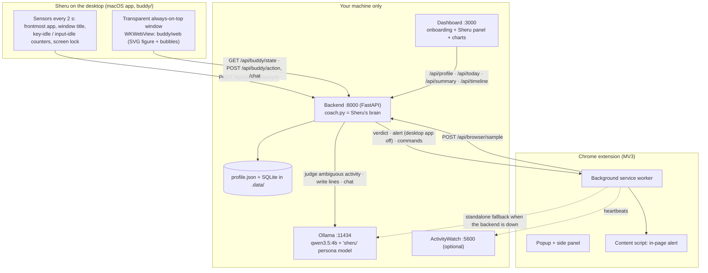

| Component | Tech | Responsibility |
|---|---|---|
| **Backend** (`pulse-backend/`) | Python 3.11, FastAPI, Pydantic, httpx, SQLite | The coach engine (detectors, judgement, messages), profile, activity log, Sheru's voice, analytics and standups; serves Sheru's UI at `/buddy`. |
| **Desktop app** (`buddy/macos`) | Swift, AppKit, WebKit, ApplicationServices | Transparent non-activating panel, click-through hit regions, cursor tracking, dragging, menu-bar item, desktop sensors. |
| **Sheru UI** (`buddy/web`) | Vanilla JS, CSS animations, SVG | The figure and its moods, speech bubbles, menu, chat; polls the backend every second. |
| **Extension** (`extension/`) | Chrome MV3, React 19, TypeScript, Vite, Tailwind 4 | Tab reporting, in-page alerts, popup and side panel; standalone engine as a fallback. |
| **Dashboard** (`dashboard/`) | React 19, Vite, Tailwind 4, Recharts | Onboarding, Sheru panel, metrics, timeline, standups. |
| **Model** (`ollama/Modelfile.sheru`) | Ollama | Sheru's persona and sampling on top of the base model (no extra download). |
| **Voice** (`pulse-backend/voice.py`) | Kokoro-82M via kokoro-onnx (fp16, CPU), macOS `say` fallback | Turns each message into speech the moment it is created (sentence chunks, cached); the page plays it with a slight pitch-up. |

Design principles:

- **One brain.** All decisions live in the backend; the desktop app, extension and dashboard only send signals and render, so they never disagree.
- **Instant first, smart second.** Every message has a template; LLM lines are prepared in the background when a detour starts and validated (name, length, at most one emoji) before use.
- **Degrades gracefully.** Without Ollama: rules and templates. Without the desktop app: in-page alerts. Without the backend: the extension's standalone engine. Without ActivityWatch: Sheru's own log.

---

## API reference

Interactive docs: http://localhost:8000/docs. JSON uses camelCase.

| Method | Path | Purpose |
|---|---|---|
| `GET` | `/api/health` | Backend, Ollama and ActivityWatch status. |
| `GET` · `PUT` · `DELETE` | `/api/profile` | Read, save (validated) or clear the onboarding profile. |
| `GET` | `/api/catalog` | Onboarding chips (work tools, distractions, goal ideas). |
| `POST` | `/api/desktop/sample` | Desktop sensors: `app, bundleId, title, keyIdle, inputIdle, locked, axTrusted`. |
| `POST` | `/api/browser/sample` | Active tab: `url, title, audible, focused, incognito, tabId, browser`; returns the verdict, any alert to show and commands. |
| `GET` | `/api/buddy/state?since=<id>` | Mood, current activity and verdict, new messages, connection flags, today's totals. |
| `POST` | `/api/buddy/action` | `{action, messageId?, minutes?}` with `action` ∈ `dismiss, snooze, back_to_work, its_work, break, hush, resume, quote, fact, poke`. |
| `POST` | `/api/buddy/chat` | `{text}` → `{reply}` in Sheru's voice. |
| `GET` · `PUT` | `/api/settings` | Read or change Sheru's settings (returns effective timings, presets and voice-engine status). |
| `DELETE` | `/api/history` | Clear the activity log (profile and settings stay). |
| `GET` | `/api/voice` | Voice engine status and available voices. |
| `POST` | `/api/voice/say` | `{text, voice?, speed?, pitch?}` → WAV of that line in Sheru's voice (saved settings unless overridden). |
| `GET` | `/api/wisdom?kind=quote\|fact\|any` | A random Vivekananda quote or fact. |
| `GET` | `/api/today` | Today's focus, neutral and detour seconds, top apps and sites, recent nudges. |
| `GET` | `/api/summary`, `/api/timeline?date=&tz=` | Daily metrics and timeline (Sheru's log, ActivityWatch or sample data). |
| `POST` | `/api/generate-standup` | Markdown standup notes for a day. |
| `GET` | `/buddy/` | Sheru's UI (also viewable in a normal browser as a preview). |

---

## Project structure

```
sheru/
├── start.sh · stop.sh · setup.sh · test.sh   one-command scripts
├── Sheru.command                              Finder double-click launcher
├── buddy/                                     Sheru, the desktop buddy
│   ├── build.sh                               swiftc build (only when sources change)
│   ├── macos/                                 main.swift, Info.plist, AppIcon.icns
│   └── web/                                   sheru.svg, buddy.js, buddy.css, index.html
├── pulse-backend/                             FastAPI backend (Sheru's brain + analytics)
│   ├── main.py                                routes
│   ├── coach.py                               coach engine and detectors
│   ├── catalog.py                             onboarding chips and app/site rules
│   ├── persona.py                             templates, LLM lines, classification, chat
│   ├── voice.py                               natural voice (Kokoro) + macOS fallback
│   ├── vivekananda.py                         cited quotes and facts
│   ├── profile_store.py · activity_store.py   profile JSON and SQLite log
│   ├── aw_queries.py · llm_service.py         summaries, timeline, standups
│   └── tests/                                 pytest suite
├── extension/                                 Chrome MV3 extension (load extension/dist)
│   └── src/                                   manifest.json, background/, content/, popup/, sidepanel/, shared/, ui/
├── dashboard/                                 React dashboard
│   └── src/                                   App.tsx, features/ (Onboarding, SettingsPage, SheruPanel, charts…), lib/
├── ollama/Modelfile.sheru                     Sheru's persona model
├── scripts/                                   lib.sh, launch-browser.mjs, install-voice.sh
├── docs/                                      images/ (README screenshots), business/ (business plan)
├── docker-compose.yml                         optional: Ollama + backend in containers
├── .data/                                     your profile, settings and history (gitignored)
├── .models/                                   natural-voice model files (gitignored)
└── .run/                                      pids, logs, browser profile (gitignored)
```

---

## Privacy, security and permissions

- **Local only.** No cloud services, accounts or telemetry. The backend binds to `127.0.0.1`; the model runs in Ollama on your machine.
- **What is stored:** your profile (`.data/profile.json`) and a log of activity segments (app or site, window title, verdict, times) plus Sheru's nudges (`.data/sheru.db`). Delete `.data/` to erase it.
- **Typing:** measured with macOS's system idle counters (`CGEventSourceSecondsSinceLastEventType`). No keystrokes are captured and no Input Monitoring permission is needed.
- **Window titles:** read through the Accessibility API. Sheru's app is started by your terminal, so macOS attributes the permission to Terminal or iTerm (*System Settings → Privacy & Security → Accessibility*). Optional.
- **Private browsing:** incognito tabs are reported only as "private window", never their URL or title.
- **Extension permissions:** host access is limited to `localhost`/`127.0.0.1` on ports 8000 (backend), 11434 (Ollama) and 5600 (ActivityWatch); only `sheru.svg` is exposed to web pages.
- **Voice:** speech is generated on your Mac; the model files come from the kokoro-onnx GitHub release once and are SHA-256 verified.
- **The Sheru browser window** uses its own profile in `.run/browser-profile/` and is started with `--remote-debugging-pipe` (a pipe, not a network port) so the extension can be installed; your everyday browser profile is never touched.

---

## Development

### Run the tests

```bash
./setup.sh --dev      # once: also installs backend test dependencies
./test.sh             # extension + dashboard + backend + Swift type-check
./test.sh --build     # … and both production builds
```

Per component: `cd extension && npm test && npm run typecheck` · `cd dashboard && npm test && npm run typecheck` · `cd pulse-backend && .venv/bin/pytest -q`.

### Run components individually

```bash
# Backend (Sheru's brain), auto-reload
cd pulse-backend && .venv/bin/uvicorn main:app --reload --port 8000

# Dashboard
cd dashboard && npm run dev -- --port 3000

# Extension: rebuild after changes, then reload it in chrome://extensions
cd extension && npm run build

# Desktop app: build and run against a backend on :8000
buddy/build.sh && buddy/build/Sheru.app/Contents/MacOS/Sheru --port 8000

# Sheru's UI without the desktop app (preview in any browser)
open http://localhost:8000/buddy/

# Sheru persona model (start.sh/setup.sh do this automatically)
ollama create sheru -f ollama/Modelfile.sheru
```

To use the extension in your everyday browser: `chrome://extensions` → **Developer mode** → **Load unpacked** → select **`extension/dist`**. The extension ID is fixed (`edaacbpplacmlbfilkabahkcmhopmpdj`) by the key in the manifest.

### Docker (backend only)

```bash
docker compose up -d
docker compose exec ollama ollama pull qwen3.5:4b
```

This runs Ollama and the backend (data persisted in the `sheru_data` volume, Sheru's UI mounted at `/buddy`). The desktop app and the extension still run on the host and connect to `http://localhost:8000`. ActivityWatch stays on the host; it must listen on an address the container can reach.

---

## Troubleshooting

### Sheru and the extension

| Symptom | Fix |
|---|---|
| Extension popup is a small blank or white box | You loaded the wrong folder or a stale build. Use the browser window `./start.sh` opens (it always installs the fresh build). In your own browser: remove the old copy (it may still be called Lighthouse), then **Load unpacked → `extension/dist`**. Loading `extension/` now shows "manifest missing" instead of a blank popup. |
| Sheru doesn't appear | Check the 🦁 menu-bar item (*Show / Hide*, *Reset position*). Read `.run/logs/buddy.log` and `.run/logs/buddy-build.log`. Building needs `xcode-select --install`. |
| Sheru says "Snoozing… I can't see my brain" | The backend isn't running: start `./start.sh`, or check `.run/logs/backend.log`. |
| Sheru knows the app but not the window title | Grant Accessibility to your terminal app, or use 🦁 → *Allow window titles…*, then restart. |
| Alerts are too fast or too slow | Change the **Nudge pace** in the dashboard (Demo, Balanced or Gentle). |
| Sheru's lines repeat or chat says its "thinking cap is napping" | Ollama isn't reachable: `curl http://localhost:11434/api/tags`; `ollama list` should include `sheru`. |
| Sheru doesn't speak | Settings → *Speak out loud* on; check the volume slider and **Preview voice**. The Voice section says which engine is active; if it says "macOS voice", run `scripts/install-voice.sh` (or `./setup.sh`). |
| Voice sounds too fast, slow or squeaky | Settings → Voice: adjust Speed and Cub pitch (0% = the voice's natural pitch). |
| Browser window didn't open | Read `.run/logs/browser.log`. Set `SHERU_BROWSER=brave` (or `edge`, or a path), or run with `--no-browser`. |
| A YouTube tutorial is flagged as a detour | Click **It's for work**: Sheru remembers. Make sure the goal words appear in your goals (e.g. "DSA", "React"). |

### Scripts and services

| Symptom | Fix |
|---|---|
| Port 8000 or 3000 already in use | `./stop.sh`, or find the process with `lsof -i :8000`; or set `BACKEND_PORT` / `DASHBOARD_PORT`. |
| `setup.sh` complains about Python | Install uv (`brew install uv`); setup then creates a Python 3.11 venv itself. |
| Node version error | Vite needs Node ^20.19 or ≥ 22.12 (21.x and 22.0–22.11 do not work). |
| Dashboard shows "Sample data" | Nothing logged yet today: Sheru's log fills as soon as the desktop app or the extension runs. |
| Extension standalone mode can't reach Ollama | Only relevant when the backend is down: `./start.sh --fix-ollama` (macOS). |
| ActivityWatch problems | See [ActivityWatch](#activitywatch-optional): quarantine flag, `cors_regex` as a list, permissions. |

Logs: `tail -f .run/logs/backend.log` (also `dashboard`, `buddy`, `browser`, `ollama`, `aw-*`).

---

## FAQ

**Is it really private?** Yes. Every component runs locally, and Sheru's history is a SQLite file in `.data/`. Nothing is sent anywhere.

**Does it work without Ollama?** Yes. Judging uses built-in rules and keyword matching, and Sheru speaks from hand-written templates. Ollama adds goal-aware judging of ambiguous titles, personalised lines, chat and AI standups.

**Windows or Linux?** The backend, dashboard and extension run on Linux (the scripts support it). Alerts then appear inside web pages. The desktop buddy is macOS-only. On Windows, use WSL or run the components manually.

**Which model?** `qwen3.5:4b` by default (fast on Apple Silicon). Any Ollama chat model works: `export LLM_MODEL=<model>` before `./setup.sh` and `./start.sh`.

**Why does the browser open in a separate window?** Chrome doesn't let scripts install extensions into your everyday profile (and Chrome 137+ ignores `--load-extension`), so the launcher uses a dedicated profile and installs the extension over the DevTools pipe. You can always load `extension/dist` into your own browser once by hand.

**Are the quotes real?** Each quote carries its source in *The Complete Works of Swami Vivekananda*; widely shared misattributions were left out. See [`pulse-backend/vivekananda.py`](pulse-backend/vivekananda.py).

---

## Roadmap

- Signed and notarised `.app` with a proper installer (no Terminal permission inheritance).
- Chrome Web Store listing.
- Windows/Linux desktop buddy.
- Weekly reflections and goal-progress insights in the dashboard.
- More buddies and Indian-language voices.

## Business plan

The business plan is in [`docs/business/Sheru_Business_Plan.pdf`](docs/business/Sheru_Business_Plan.pdf). Regenerate it with `uv run --with reportlab --with matplotlib python docs/business/build_business_plan.py`.

## License

No license has been chosen yet, so all rights are reserved by the author. Add a `LICENSE` file (for example MIT) before others reuse or contribute to the code.

## Credits

- Quotes from *The Complete Works of Swami Vivekananda* (Advaita Ashrama).
- [Ollama](https://ollama.com) and the [Qwen](https://github.com/QwenLM) models for on-device language understanding.
- [Kokoro-82M](https://huggingface.co/hexgrad/Kokoro-82M) (Apache-2.0) via [kokoro-onnx](https://github.com/thewh1teagle/kokoro-onnx) for Sheru's natural voice.
- [ActivityWatch](https://activitywatch.net) for the optional activity timeline.
- Sheru was drawn as an original SVG for this project.
