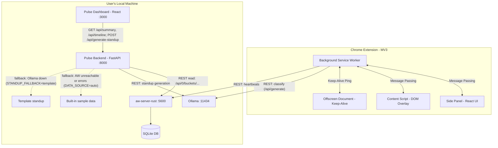
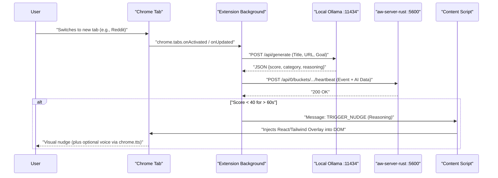

# Lighthouse

**Your privacy-first, local AI focus coach. Stop analyzing past distractions; start preventing them in real-time.**

Lighthouse is an intelligent, HeyClicky-inspired web companion built on ActivityWatch. It operates entirely on your machine, using local AI (Ollama) to understand the context of your browsing in real-time, proactively nudge you away from distractions, and synthesize your work sessions into actionable insights. No data leaves your machine.

---

## Quick Navigation

- [Run it in 2 minutes](#run-it-in-2-minutes)
- [Scripts reference](#scripts-reference)
- [Everyday commands](#everyday-commands)
- [Manual setup (without scripts)](#manual-setup-without-scripts)
- [Configuration](#configuration)
- [Architecture](#architecture)
- [Troubleshooting](#troubleshooting)

---

## Run it in 2 minutes

### Prerequisites

**macOS or Linux** (the scripts need `bash`, `curl`, `lsof`; Windows: use WSL or the manual setup below) • **Node.js** ^20.19 or ≥22.12 • **Python** ≥3.10 (or `uv`) • **Ollama** (optional: without it the extension uses heuristic mode and standups use a template) • **ActivityWatch** (optional: without it the backend uses sample data) • **Chrome/Brave** 116+

```bash
# Clone the repo and enter the directory
git clone https://github.com/saksham-eng560/vivekanand.git && cd vivekanand

# One-time setup (installs deps, pulls the LLM model, builds the extension)
./setup.sh

# Start everything (backend + dashboard; also Ollama / ActivityWatch, but only if installed)
./start.sh
```

After `./start.sh` completes, your browser will open the dashboard at http://localhost:3000. Then:

### Load the Extension

1. Open `chrome://extensions/`
2. Enable **Developer mode** (top-right toggle)
3. Click **Load unpacked** and select the `extension/dist/` folder
4. You should see "Lighthouse" in your toolbar

### Try the Demo

1. Click the **Lighthouse icon** in the toolbar, then click **Open side panel** in the popup
2. Type a goal (e.g., "Building a React dashboard") and click **Start Session**
3. Browse normally—when you stray off-task, a nudge appears; watch the focus score update in real-time

**For a full walkthrough,** see the [60-Second Demo Script](#60-second-demo-script).

**To stop:** Press Ctrl+C in the terminal running `./start.sh`.

---

## Scripts Reference

These scripts automate setup, startup, and testing. All are idempotent. They need `bash`, `curl` and `lsof` and support macOS and Linux only (on Windows use WSL or the manual setup).

| Script | What it does | Key flags | Example |
|--------|-------------|-----------|---------|
| `./setup.sh` | One-time install: checks Node/Python, installs deps, pulls the LLM model, builds the extension. Idempotent—safe to run multiple times. | `--dev` (also install test deps), `--skip-model` (don't pull LLM), `--with-env` (copy `.env.example` to `.env`), `-h/--help` | `./setup.sh --dev --with-env` |
| `./start.sh` | Runs setup if needed; starts Ollama (if installed), aw-server (only if installed), backend, and dashboard. Waits for services to be healthy, then prints a summary and opens the dashboard. Ctrl+C stops all services. | `--detach`/`-d` (run in background; use `./stop.sh` to stop), `--no-open` (don't open dashboard in browser), `--fix-ollama` (macOS only; see below), `-y/--yes` (skip the `--fix-ollama` prompt; required without a TTY), `-h/--help` | `./start.sh -d`, `./start.sh --fix-ollama` |
| `./stop.sh` | Stops anything recorded in `.run/*.pid` (dashboard, backend, aw-server, ollama). A pid is only signalled if it is still the process that was started (command and start time are checked); otherwise the pid file is treated as stale and removed. Does nothing if there are no pid files. | (none) | `./stop.sh` |
| `./test.sh` | Runs all three test suites (extension, backend, dashboard) and shows a pass/fail table. Needs `./setup.sh` (use `--dev`) run first; it only auto-installs the backend test dependencies if `pytest` is missing. | `--build` (also run both `npm run build`s, after the tests), `-h/--help` | `./test.sh --build` |

**`--fix-ollama` (macOS only)** has side effects, so it prints its plan and the matching `ollama serve` processes and asks `[y/N]` (pass `--yes` to skip; without a TTY `--yes` is required). It: (1) runs `launchctl setenv OLLAMA_ORIGINS "chrome-extension://*"`, which stays set for all apps until you log out, reboot or unset it, (2) quits the Ollama app, (3) stops any `ollama serve` process still running afterwards, (4) relaunches Ollama. Undo with `launchctl unsetenv OLLAMA_ORIGINS`. It only applies to a local Ollama: if `OLLAMA_URL` points to another host, it exits non-zero without changing anything (and `start.sh` never starts a local `ollama serve` for a remote URL).

Environment overrides (export them in your shell; the scripts do not read `.env` files for these):
- `LLM_MODEL` – `./setup.sh`: pulls this model **and** builds the extension with it (`VITE_LLM_MODEL`). `./start.sh`: passed to the backend only if set; otherwise the backend uses `pulse-backend/.env` or its default (`qwen3.5:4b`). `./test.sh --build` also builds the extension with it when set. Use the same value for all scripts.
- `BACKEND_PORT` (default 8000), `DASHBOARD_PORT` (default 3000) – `./start.sh` only.
- `OLLAMA_URL` (default `http://localhost:11434`), `AW_SERVER_URL` (default `http://localhost:5600`) – used by the scripts' readiness probes (and `OLLAMA_URL` also sets `OLLAMA_HOST` for the `ollama` commands the scripts run); the backend itself reads its own `pulse-backend/.env`.

The first run downloads the model (several GB; this can take minutes).

Logs are written to `.run/logs/` (backend.log, dashboard.log, ollama.log) and `.run/<name>.pid` files (pid plus start time) track running services.

---

## Everyday Commands

```bash
# Start services in the background (don't block your terminal)
./start.sh --detach

# Stop background services
./stop.sh

# Run all tests
./test.sh

# Watch backend logs
tail -f .run/logs/backend.log

# Watch dashboard logs
tail -f .run/logs/dashboard.log

# Check if Ollama is running and properly configured
curl http://localhost:11434/api/tags

# Check if the backend is up
curl http://localhost:8000/docs   # use $BACKEND_PORT if you overrode it
```

---

## Why Lighthouse?

### The Problem
- **Retrospective guilt:** Existing time trackers (RescueTime, basic ActivityWatch) show you *after* the fact that you wasted 3 hours on YouTube.
- **Static rules fail:** A blocklist can't tell if YouTube is productive (learning React) or a distraction (watching cat videos)—context matters.
- **Privacy vs. Intelligence:** Cloud-based AI assistants require sending your entire browsing history and screen data to external servers.

### How Lighthouse Differs
- **Proactive, not passive:** Real-time visual nudges and side-panel interactions when you stray off-task, not guilt-driven reports at day's end.
- **Context-aware:** Uses local LLMs (Ollama) to analyze page titles and URLs dynamically against your *current goal*.
- **Zero-cloud privacy:** Built on ActivityWatch's local SQLite and Ollama. No data transmission. No cloud surveillance.

---

## Features

### P0 — MVP (Hackathon)
- **Smart tab tracking:** Chrome MV3 extension monitors active URL, title, and audio state, feeding a local ActivityWatch server.
- **AI intent classification:** Real-time LLM evaluation (`qwen3.5:4b`, `llama3`, or `phi3`) scores your current page (0–100) and categorizes it based on your declared goal.
- **Gentle nudges:** Non-punitive DOM overlays slide in when focus drops below 40/100 for more than 60 seconds (demo mode: 5 seconds).
- **Side Panel UI:** Set goals, view live focus score, manage sessions, see AI/ActivityWatch status.
- **Dashboard & insights:** React dashboard showing Active vs. Distraction time, context switches, timeline charts, and AI-generated standup notes.

### P1 — Enhanced
- Session receipts (AI summaries of deep-work blocks).
- **Voice nudges (done):** spoken nudges ("Focus back on VS Code") via `chrome.tts`.
- **Tab amnesia fix (done):** tabs are grouped automatically by AI category, and Context Reset suggests which low-focus tabs to close.

### P2 — Future
- macOS desktop integration (ScreenCaptureKit).
- Multi-agent workspace (custom avatars per task).
- Burnout detection (switch-rate analysis).

---

## Architecture

### System Overview



### Event Flow



The Pulse backend reads events from aw-server over its REST API (not the SQLite file directly). If aw-server is unreachable (or returns an error) and `DATA_SOURCE=auto`, it serves built-in sample data; if Ollama is down and `STANDUP_FALLBACK=template`, it returns a deterministic template standup.

**Key principle:** All data processing happens locally. The extension, Ollama, ActivityWatch, backend, and dashboard run on your machine only. No external APIs, no cloud, no telemetry.

---

## Repository Structure

```
lighthouse/
├── README.md                    (This file)
├── Plan.md                      (Product spec)
├── .env.example                 (Configuration template)
├── docker-compose.yml           (Optional: Ollama + backend in containers)
├── setup.sh                     (One-time setup script)
├── start.sh                     (Start all services)
├── stop.sh                      (Stop background services)
├── test.sh                      (Run all test suites)
├── scripts/
│   └── lib.sh                   (Shared shell utilities for the scripts)
├── docs/
│   └── business/                (Business plan)
│       ├── Lighthouse_Business_Plan.pdf
│       ├── build_business_plan.py  (Regenerates the PDF)
│       └── charts/              (Generated chart images)
├── .run/                        (Created at runtime; gitignored)
│   ├── <name>.pid               (PID + start time per service: backend, dashboard, ...)
│   └── logs/
│       ├── backend.log
│       ├── dashboard.log
│       └── ollama.log
│
├── extension/                   (Chrome MV3 extension)
│   ├── manifest.json
│   ├── package.json
│   ├── vite.config.ts
│   ├── tsconfig.json
│   ├── scripts/                 (gen-icons.mjs)
│   ├── src/
│   │   ├── background/          (Service worker & tab tracking)
│   │   │   ├── index.ts
│   │   │   ├── aw-client.ts    (ActivityWatch REST calls)
│   │   │   ├── llm-client.ts   (Ollama API)
│   │   │   ├── state.ts        (In-memory state, persistence)
│   │   │   └── nudge.ts        (Distraction detection logic)
│   │   ├── content/             (Injects DOM overlay)
│   │   │   ├── index.tsx
│   │   │   └── Overlay.tsx
│   │   ├── sidepanel/           (React UI: goal setting, timer, status)
│   │   │   ├── App.tsx
│   │   │   └── index.html
│   │   ├── popup/               (Quick goal dialog)
│   │   │   ├── App.tsx
│   │   │   └── index.html
│   │   ├── offscreen/           (Keep-alive for service worker)
│   │   │   ├── index.html
│   │   │   └── keepalive.js
│   │   ├── shared/              (Message types & constants)
│   │   │   ├── messages.ts
│   │   │   └── types.ts
│   │   └── assets/              (Icons)
│   └── dist/                    (Built output—load unpacked here)
│
├── pulse-backend/               (FastAPI analytics server)
│   ├── main.py                  (Routes: /api/summary, /api/timeline, etc.)
│   ├── config.py                (Environment & settings)
│   ├── models.py                (Pydantic response models)
│   ├── aw_queries.py            (Fetch & process ActivityWatch events)
│   ├── llm_service.py           (Ollama calls for standup generation)
│   ├── sample_data.py           (Fallback demo data)
│   ├── requirements.txt         (Runtime deps; used by the Docker image)
│   ├── requirements-dev.txt     (Adds pytest/respx for tests)
│   ├── pytest.ini
│   ├── Dockerfile
│   └── tests/
│       ├── test_api.py
│       ├── test_aw_queries.py
│       ├── test_contract.py
│       ├── test_llm_service.py
│       ├── test_sample_data.py
│       └── conftest.py
│
└── dashboard/                   (React + Vite web UI)
    ├── package.json
    ├── tsconfig.json
    ├── vite.config.ts
    ├── index.html
    ├── src/
    │   ├── App.tsx
    │   ├── main.tsx
    │   ├── components/ui/       (shadcn-like UI elements)
    │   ├── features/            (MetricCards, TimelineChart, etc.)
    │   ├── lib/
    │   │   ├── api.ts          (axios client)
    │   │   └── types.ts
    │   └── *.test.ts
    └── dist/                    (Built output)
```

---

## Manual Setup (without scripts)

If you prefer to set up manually without using the provided scripts, follow these steps. This is useful for development, debugging, or custom configurations.

### Prerequisites

- **Node.js** 20.19+ or 22.12+ (for Vite)
- **Python** 3.11 (via `uv venv --python 3.11` or system Python ≥3.10)
- **Chrome** or **Brave** (latest, for MV3 extensions)
- **Ollama** (from https://ollama.com/download)
- **ActivityWatch** `aw-server-rust` (from https://activitywatch.net/downloads/)

### 1. Set Up Ollama

```bash
# Install Ollama (one-time)
# From https://ollama.com/download

# Start Ollama with the extension origin enabled
# macOS (app):
launchctl setenv OLLAMA_ORIGINS "chrome-extension://*"
# Restart the Ollama app

# Linux or macOS (CLI):
export OLLAMA_ORIGINS="chrome-extension://*"
ollama serve

# Pull a model (if not already present)
ollama pull qwen3.5:4b
# Or: ollama pull llama3, ollama pull phi3
```

**Verify:** `curl http://localhost:11434/api/tags` → should return 200 OK with model list.

### 2. Set Up ActivityWatch

```bash
# Download aw-server-rust from https://activitywatch.net/downloads/
# Unzip and run (macOS/Linux):
./aw-server

# CRITICAL: Allow extension origin in config
# macOS: ~/Library/Application Support/activitywatch/aw-server-rust/config.toml
# Linux: ~/.config/activitywatch/aw-server-rust/config.toml
# Add this line:
#   cors_regex = "chrome-extension://.*"
# Then restart aw-server
```

**Verify:** Open http://localhost:5600 → should see ActivityWatch dashboard.

### 3. Set Up Backend

```bash
cd pulse-backend

# Option A: Using uv (recommended)
uv venv --python 3.11
. .venv/bin/activate
uv pip install -r requirements.txt   # use requirements-dev.txt to also run tests

# Option B: Using standard venv
python3 -m venv .venv
source .venv/bin/activate  # on Windows: .venv\Scripts\activate
pip install -r requirements.txt   # use requirements-dev.txt to also run tests

# Start backend
uvicorn main:app --reload --port 8000
```

**Verify:** Navigate to http://localhost:8000/docs → should see Swagger UI with endpoints.

### 4. Set Up Dashboard

```bash
cd dashboard
npm install
npm run dev
```

**Verify:** Open http://localhost:3000 (the dev server does not open a browser itself). You should see metric cards (likely showing sample data if ActivityWatch is empty).

### 5. Build & Load Extension

```bash
cd extension
npm install
npm run build
```

**Load into Chrome:**
1. Open `chrome://extensions/`
2. Enable **Developer mode** (top-right toggle)
3. Click **Load unpacked**
4. Select the `extension/dist/` folder
5. You should see "Lighthouse" extension loaded (icon in toolbar)

**Open Side Panel:**
- Click the Lighthouse icon in the toolbar, then click **Open side panel** in the popup
- A side panel opens on the right
- Type a goal: "Building a React dashboard"
- Click **Start Session** or pick a duration (25 min, 50 min)
- Watch the focus gauge and status badges update as you browse

---

## Configuration

All settings are environment variables. Copy the relevant section into a `.env` file in each directory:

### Extension (`extension/.env`)
```env
VITE_OLLAMA_URL=http://localhost:11434
VITE_AW_URL=http://localhost:5600
VITE_LLM_MODEL=qwen3.5:4b
VITE_NUDGE_THRESHOLD_SECONDS=60
```

- `VITE_OLLAMA_URL` – local Ollama API endpoint
- `VITE_AW_URL` – local ActivityWatch server
- `VITE_LLM_MODEL` – model name (`qwen3.5:4b`, `llama3`, `phi3`, etc.)
- `VITE_NUDGE_THRESHOLD_SECONDS` – seconds before nudge triggers (default 60; demo mode: 5)

### Backend (`pulse-backend/.env`)
```env
AW_SERVER_URL=http://localhost:5600
OLLAMA_URL=http://localhost:11434
LLM_MODEL=qwen3.5:4b
DATA_SOURCE=auto
STANDUP_FALLBACK=template
AW_BUCKET_PREFIX=aw-watcher-web-lighthouse
LLM_TIMEOUT_SECONDS=120
```

- `AW_SERVER_URL` – ActivityWatch server URL
- `OLLAMA_URL` – Ollama API endpoint
- `LLM_MODEL` – which model to use for standup generation
- `DATA_SOURCE` – `auto` (default, tries AW, falls back to sample), `aw` (strict), `sample` (demo data)
- `STANDUP_FALLBACK` – `template` (deterministic fallback if Ollama fails), `off` (return 503)
- `AW_BUCKET_PREFIX` – ActivityWatch bucket name prefix (default: `aw-watcher-web-lighthouse`)
- `LLM_TIMEOUT_SECONDS` – timeout for LLM calls (default 120)

### Dashboard (`dashboard/.env`)
```env
VITE_API_URL=http://localhost:8000
```

- `VITE_API_URL` – Pulse backend API root

---

## Business Plan

The business plan is at [`docs/business/Lighthouse_Business_Plan.pdf`](docs/business/Lighthouse_Business_Plan.pdf). Every figure in it derives from one model section in the generator script. Regenerate it with:

```bash
uv run --with reportlab --with matplotlib python docs/business/build_business_plan.py
```

---

## Running Tests

The easiest way is `./test.sh` (after `./setup.sh --dev`), which runs all three suites. To run them by hand, each component has its own test suite:

```bash
# Extension
cd extension
npm run test

# Backend
cd pulse-backend
pip install -r requirements-dev.txt   # or: uv pip install -r requirements-dev.txt
pytest -q

# Dashboard
cd dashboard
npm run test
```

All tests must pass before commits. Type-check all directories:
```bash
cd extension && npm run typecheck
cd ../pulse-backend && python -m pytest --collect-only > /dev/null  # validates imports
cd ../dashboard && npm run typecheck
```

---

## 60-Second Demo Script

1. **[0:00–0:10] Set Goal:** Open the side panel (click the Lighthouse icon, then click **Open side panel** in the popup). Type: *"Building a React dashboard."* Select **25 min**. Click **Start Session**.

2. **[0:10–0:25] Productive Work:** Open a VS Code web tab or GitHub. Watch the side panel:
   - Focus Score: **95/100**
   - Category: **Coding**
   - AI status: **Online**
   - Reason: *"Relevant to React dashboard"*

3. **[0:25–0:40] The Distraction:** Open a new tab and navigate to Reddit. Wait ~5 seconds (demo mode threshold; normal is 60 seconds).

4. **[0:40–0:45] The Nudge:** A styled overlay slides in from the bottom-right:
   > *"Taking a break? reddit.com doesn't align with 'Building a React dashboard'. (Score: 10/100)"*
   
   Buttons: **Dismiss** | **Back to Work**

5. **[0:45–0:60] Standup Magic:** Switch to the Pulse Dashboard (http://localhost:3000). Click **Generate Standup**. Text types out:
   > *"Today, you spent 15 minutes focused on the React dashboard. You reviewed code on GitHub and spent 5 minutes on Reddit. Tomorrow, stay focused on component architecture."*
   
   Emphasize: **✅ No data left your machine.**

---

## Troubleshooting

### Script-Specific Issues

**Port already in use?**
- If `./start.sh` fails with "port already in use" (e.g., for 8000 or 3000):
  - Find and stop the process: `lsof -i :8000` (shows PID), then `kill <PID>`
  - Or use `./stop.sh` if services are running in detached mode
  - Then retry `./start.sh`

**Ollama not found or won't start?**
- Install from https://ollama.com/download
- Verify installation: `ollama --version`
- If Ollama is already running but the extension can't reach it:
  - On **macOS**: Run `./start.sh --fix-ollama` (asks for confirmation; sets a persistent `launchctl` variable, restarts Ollama; undo: `launchctl unsetenv OLLAMA_ORIGINS`)
  - Manually: Set `OLLAMA_ORIGINS="chrome-extension://*"` and restart the Ollama app

**Python version too old?**
- Install `uv` (fastest package manager): `curl -LsSf https://astral.sh/uv/install.sh | sh`
- Then `./setup.sh` will use `uv` to create a Python 3.11 venv automatically

**setup.sh or start.sh says "command not found"?**
- Ensure you're in the repo root: `pwd` should show `.../vivekanand`
- Make scripts executable: `chmod +x setup.sh start.sh stop.sh test.sh`
- Try with `bash ./setup.sh` explicitly

**Where are the logs?**
- `.run/logs/backend.log` – FastAPI server logs
- `.run/logs/dashboard.log` – React dev server logs
- `.run/logs/ollama.log` – Ollama server logs
- Watch in real-time: `tail -f .run/logs/backend.log`

### Extension Offline Modes

| Mode | Trigger | Behavior |
|------|---------|----------|
| **Online** | Ollama reachable | Full AI classification (score, category, reasoning) |
| **Heuristic** | Ollama 403/timeout/unreachable | Fallback deterministic scoring based on domain and goal keyword match; badge: "AI offline – heuristic mode" |
| **AW Offline** | ActivityWatch unreachable | Buffer events locally; badge: "ActivityWatch offline"; flush on reconnect |

### Common Issues

**AI says "offline – heuristic mode"?**
- Ollama is not reachable or not configured to accept extension requests.
- **macOS:** Run `./start.sh --fix-ollama` (see Scripts Reference for its side effects).
- **Linux/manual:** Set `export OLLAMA_ORIGINS="chrome-extension://*"` before starting Ollama, then restart.
- Verify: `curl http://localhost:11434/api/tags` should return 200 OK.

**403 from Ollama or ActivityWatch?**
- Ensure `OLLAMA_ORIGINS` is set and Ollama is restarted.
- Ensure `cors_regex` is in aw-server config and aw-server is restarted.

**Extension says "Demo mode" on load?**
- Demo mode is a side panel setting, not an env var. In the side panel under Preferences, turn off the **Demo mode** toggle to restore the normal 60-second nudge threshold and cooldown (demo mode forces 5 s / 30 s).
- `VITE_NUDGE_THRESHOLD_SECONDS` only sets the default threshold (60) and is separate from the toggle.

**No data showing in dashboard?**
- Did you set a goal and browse? ActivityWatch needs ≥1 event.
- Check backend logs: `tail -f .run/logs/backend.log` should show request traces.
- Try `DATA_SOURCE=sample` in `.env` to see demo data.

**Standup returns "No tracked activity" always?**
- Ensure date is correct (`YYYY-MM-DD`, default today).
- Check if ActivityWatch has events for that date in the bucket `aw-watcher-web-lighthouse`.

**Extension doesn't load unpacked?**
- Ensure `extension/dist/manifest.json` exists: `ls extension/dist/manifest.json`
- Check console for errors: `chrome://extensions/` → Lighthouse → **Errors**.
- Try: `cd extension && npm run typecheck && npm run build`, then reload the extension.

---

## Docker Compose (Optional)

For running Ollama and the backend in containers:

```bash
docker compose up -d
```

Services:
- **ollama** – `localhost:11434` (runs the Ollama server; the model is not pulled automatically, so run `docker compose exec ollama ollama pull qwen3.5:4b` after the first start)
- **pulse-backend** – `localhost:8000` (FastAPI server)
- **aw-server** – **NOT in compose** (runs on host at `localhost:5600`)

Environment variables (`.env` at repo root):
```env
LLM_MODEL=qwen3.5:4b
DATA_SOURCE=auto
STANDUP_FALLBACK=template
AW_BUCKET_PREFIX=aw-watcher-web-lighthouse
LLM_TIMEOUT_SECONDS=120
```

**Note:** The backend container uses `host.docker.internal:5600` to reach aw-server on your host machine, so aw-server must listen on an address reachable from the container (e.g. `address = "0.0.0.0"` in its `config.toml`). If it is not reachable or rejects the request, `DATA_SOURCE=auto` falls back to sample data.

---

## Tech Stack

| Component | Stack |
|-----------|-------|
| **Extension** | Chrome MV3, React 19, TypeScript, Vite, Tailwind CSS 4, Framer Motion |
| **Backend** | Python 3.11, FastAPI 0.142, Pydantic 2.13, httpx (async) |
| **Dashboard** | React 19, Vite, Tailwind CSS 4, Recharts, Markdown rendering |
| **AI** | Ollama (local LLM server), qwen3.5:4b / llama3 / phi3 |
| **Data** | ActivityWatch (SQLite), local REST APIs |
| **Testing** | Vitest (extension/dashboard), pytest (backend) |

---

## Roadmap (P2)

- [ ] **Mac native integration** – ScreenCaptureKit for full-screen awareness (like HeyClicky).
- [ ] **Multi-agent workspace** – Custom avatars for different tasks.
- [ ] **Burnout detection** – Analyze context-switch rate to detect fatigue.
- [ ] **Chrome Web Store** – Official distribution (currently: developer-mode only).

---

## License

MIT (placeholder—add LICENSE file if needed).

---

## Questions?

- **How private is it?** Completely. All data stays on your machine. Ollama and ActivityWatch run locally. No cloud calls. No telemetry.
- **Which LLM should I use?** `qwen3.5:4b` (default, fast), `llama3` (accurate), or `phi3` (small, low-resource).
- **Can I run this on Windows?** Not with the scripts (macOS/Linux only). Use WSL, or follow the Manual Setup section after installing Ollama, Python, Node, and aw-server-rust; paths will differ (e.g., `%APPDATA%\activitywatch\...`).
- **What if Ollama is slow?** The extension has an 8-second timeout and falls back to heuristic mode. Dashboard also gracefully handles slowness.
- **Can I customize the nudge message?** Yes—edit `extension/src/content/Overlay.tsx` and rebuild.

---

**Made for the privacy-conscious, the ADHD knowledge worker, and anyone tired of guilt-driven time trackers.** ⏰
