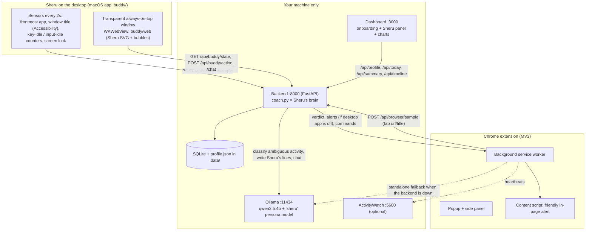
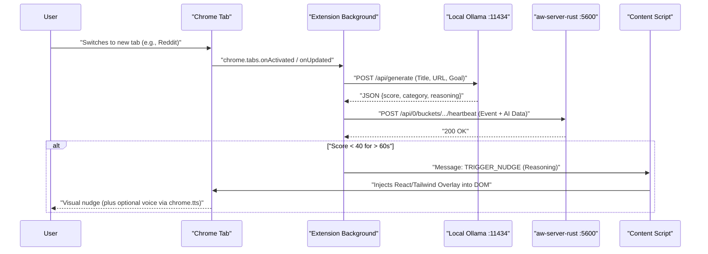

# Lighthouse · meet Sheru 🦁

**A private, local focus buddy for your Mac.** Sheru is a little lion cub in a saffron turban who sits in the top-left corner of your screen. He knows your goals, watches what you are doing across the whole computer (apps, window titles, browser tabs, typing rhythm), and nudges you back, kindly and with humour, when you drift. In the quiet moments he shares a line from Swami Vivekananda or a fact about his life.

Everything runs on your machine: a local model (Ollama) for judgement and Sheru's voice, a local database for your history. Nothing leaves your computer.

> *"Come up, O lions, and shake off the delusion that you are sheep."* (Swami Vivekananda, Chicago, 1893)
> Sheru grew up on Swamiji's parable of the lion cub raised among sheep. When you wander off to a feed, he reminds you that you're a lion.

---

## Quick Navigation

- [Run it (one command)](#run-it-one-command)
- [What you'll see](#what-youll-see)
- [How Sheru decides you're distracted](#how-sheru-decides-youre-distracted)
- [60-second showcase](#60-second-showcase)
- [Privacy and permissions](#privacy-and-permissions)
- [Scripts reference](#scripts-reference)
- [Architecture](#architecture)
- [Troubleshooting](#troubleshooting)

---

## Run it (one command)

**Prerequisites (macOS):** Node.js ≥ 20.19 · Python ≥ 3.10 or [`uv`](https://docs.astral.sh/uv/) · Xcode Command Line Tools (`xcode-select --install`, for Sheru's desktop app) · Google Chrome, Brave or Edge · [Ollama](https://ollama.com/download) (optional but recommended: Sheru's personalised lines and smart judging) · [ActivityWatch](https://activitywatch.net) (optional).

```bash
git clone https://github.com/saksham-eng560/vivekanand.git && cd vivekanand
./start.sh
```

Or **double-click `Lighthouse.command`** in Finder. Same thing, in a Terminal window; close it (or press Ctrl+C) to stop everything.

The first run installs everything (`./setup.sh`: npm + Python deps, the LLM, the `sheru` persona model, the extension build and the desktop app). Then `./start.sh`:

1. starts Ollama, builds the **`sheru` model** (your base model + Sheru's persona, `ollama/Modelfile.sheru`, no extra download),
2. starts the backend (Sheru's brain, `:8000`) and the dashboard (`:3000`),
3. puts **Sheru on your desktop** (top-left, plus a 🦁 menu-bar item),
4. opens a **browser window with the Lighthouse extension already installed** and the onboarding page.

`./stop.sh` stops everything (when started with `--detach`). Useful flags: `--fresh` (start onboarding again), `--no-browser`, `--no-buddy`, `--detach`.

> **Why a separate browser window?** Chrome deliberately does not let scripts install extensions into your everyday profile, and Chrome 137+ ignores `--load-extension`. The launcher (`scripts/launch-browser.mjs`) starts your Chrome/Brave/Edge with its own *Lighthouse* profile and installs the extension through the DevTools protocol. To use the extension in your normal browser instead: `chrome://extensions` → Developer mode → **Load unpacked** → choose **`extension/dist`** (the `dist` folder, not `extension/`).

### ActivityWatch setup (optional)

Sheru does not need ActivityWatch (it keeps its own local log). If you also want ActivityWatch's timeline: To track real activity:

1. Download ActivityWatch from https://activitywatch.net/downloads/ and unzip it anywhere, e.g. `~/Downloads/activitywatch` or `/Applications/activitywatch` (or install `ActivityWatch.app`; it is found automatically, its Rust server lives in `Contents/Frameworks`, and `AW_HOME=/Applications/ActivityWatch.app` also works). The Python `aw-server` is used only if no Rust server exists anywhere, because it does not support `cors_regex` (the extension would be blocked). If it lives somewhere else, `export AW_HOME=/path/to/activitywatch` (the folder containing `aw-server-rust/`, `aw-watcher-window/`, `aw-watcher-afk/`; pointing at the server binary also works). If `AW_HOME` contains no server, `./start.sh` prints a warning, ignores it and uses the next install it finds (it does not fail). Only a local `AW_SERVER_URL` (localhost/127.0.0.1/::1) makes `./start.sh` start a server or watchers.
2. Run `./start.sh`. If ActivityWatch is not already running it searches `AW_HOME`, `PATH`, `/Applications/ActivityWatch.app`, `~/Applications/ActivityWatch.app`, `~/Downloads/activitywatch`, `~/activitywatch`, `/Applications/activitywatch` and `~/Applications/activitywatch`, then starts `aw-server-rust` plus `aw-watcher-window` and `aw-watcher-afk` itself. You do **not** need the `aw-qt` tray app. If you installed `/Applications/ActivityWatch.app`, just open it: `./start.sh` detects it on `:5600` and does not start its own server. `./stop.sh` stops them (watchers first). Use `--no-aw-watchers` to start only the server. If ActivityWatch is already running from another launcher (e.g. aw-qt), watchers are not started unless you pass `--aw-watchers`, which may then duplicate watchers that are already running.
3. If macOS kills the downloaded binaries (exit 137 / "did not come up"), clear the quarantine flag yourself: `xattr -dr com.apple.quarantine ~/Downloads/activitywatch` (use your actual folder).
4. Let the extension write to ActivityWatch by adding this line to `~/Library/Application Support/activitywatch/aw-server-rust/config.toml` (macOS) or `~/.config/activitywatch/aw-server-rust/config.toml` (Linux), then restart aw-server (`./stop.sh && ./start.sh`). `./start.sh` checks this and prints the line if it is missing; it never edits the file:
   ```toml
   cors_regex = ["chrome-extension://edaacbpplacmlbfilkabahkcmhopmpdj"]
   ```
5. The first time the watchers run, macOS asks for **Accessibility** permission (window watcher) and **Input Monitoring** (AFK watcher). Grant them in System Settings -> Privacy & Security for the app you launch `./start.sh` from (Terminal/iTerm), then re-run `./start.sh`. Re-running restarts our watchers only when `./start.sh` owns the server; if ActivityWatch.app / aw-qt runs it, that app's own watchers are used.

   **What the watchers record (privacy):** `aw-watcher-window` records the active application and its full window titles; `aw-watcher-afk` records whether you are active or idle at the keyboard/mouse. Both are on by default, are stored only in the local aw-server database (macOS: `~/Library/Application Support/activitywatch/aw-server-rust/`, Linux: `~/.local/share/activitywatch/aw-server-rust/`), and never leave your machine. The data **persists after `./stop.sh`**. Disable with `./start.sh --no-aw-watchers`. To delete it, run `./stop.sh` and remove that folder (or delete buckets in the ActivityWatch UI at http://localhost:5600).

## What you'll see

**1. Onboarding (dashboard, under a minute).** Name and age → your goals (type your own or tap a suggestion) and the apps/sites where work happens → what usually distracts you, how fast Sheru should speak up (**Gentle**, **Balanced**, or **Demo** for showcasing), how often you'd like Swamiji's quotes, chime/voice. Edit any time with **Edit goals**.

**2. Sheru on your desktop.** A transparent, always-on-top window in the top-left corner. His eyes follow your cursor; he blinks, flicks his tail, waves, naps when you're away and sips chai on breaks. Click him for a menu (**Swamiji quote · Fun fact · Talk to me · 5-min break · Quiet 30 min · Dashboard**); drag him anywhere. Everything else on screen stays clickable; only Sheru and his speech bubble catch the mouse.

**3. Friendly alerts, never flashing.** A speech bubble with a short, warm, personalised line (written by the local model in Sheru's voice, with an instant template fallback) and buttons: **Back to work** (brings your last work app/tab to the front), **2 more min**, **It's for work** (Sheru remembers). When you return, he cheers.

**4. The browser extension.** Reports the active tab to Sheru's brain, shows the same friendly alert inside the page when the desktop app isn't running, and its popup shows your goals, what Sheru thinks of the current tab, today's focus/detour minutes and quick actions. The side panel keeps the classic focus sessions, tab grouping and extension manager.

**5. The dashboard.** Live Sheru panel (status, goals, nudge pace, connections, recent nudges), your day's focus timeline and categories built from Sheru's whole-computer log, and an AI-written standup.

## How Sheru decides you're distracted

Every second the coach (`pulse-backend/coach.py`) merges two signals:

- **Desktop** (Sheru's app, every 2 s): frontmost app, its window title, seconds since your **last key press** and since **any input**, screen lock. Typing is measured with the system's idle counters. No key logging: Sheru knows *when* you typed, never *what*.
- **Browser** (extension): active tab URL and title, audio, window focus.

Each activity is judged against **your goals**: your own "it's for work" choices first, then your onboarding chips, then built-in rules (editors, docs, LeetCode → work; feeds, streaming, shopping → detours), and for anything ambiguous (YouTube, an unknown site or app) the **local model** decides from the title. *"Graph algorithms in 20 minutes – YouTube"* counts as DSA practice; *"Funny cats – YouTube"* does not.

Four detectors, timed by your pace (`demo` / `balanced` / `gentle`):

| Detector | When | What Sheru does |
|---|---|---|
| **Writing stall** | You were typing in a writing app (editor, doc, LeetCode…) and stopped | 1st: *"Thinking pause?"* + a Vivekananda quote as fuel · 2nd: *"Still stuck? One messy line."* · 3rd: **"You seem distracted"**, a gentle alert with Reset / Break / 2 more min. Typing again clears it with a cheer. (15 s / 90 s / 3 min per step) |
| **Detour** | An off-goal app or site in front | Playful alert (10 s / 45 s / 2 min), then a firmer, funny one if you stay. Going back to work celebrates. |
| **Hopping** | Lots of app/tab switching in a short time | *"Pick just one thing for the next 10 minutes?"* |
| **Quiet moments** | Not typing, not distracted | A Swami Vivekananda quote (from the Complete Works, cited) or a fact about his life, every few minutes. |

Plus: away from the keyboard or screen locked → Sheru naps (no nudges) and welcomes you back; long focus streaks get celebrated; breaks and "quiet" mode silence him.

## 60-second showcase

1. `./start.sh --fresh` (or double-click `Lighthouse.command`). The browser opens the onboarding; Sheru waves from the top-left.
2. Onboard in ~30 s: your name, a goal like *Crack DSA for placements*, tick *VS Code* and *LeetCode*, tick *Instagram*/*YouTube*, choose **Demo** pace. Sheru greets you by name with Swamiji's *"Arise, awake…"*.
3. **Typing stall:** open a doc or your editor, type a line, then stop. ~15 s later: *"Thinking pause?"* + quote; ~30 s: *"Still stuck?"*; ~45 s: **"You seem distracted"**. Type a word: Sheru cheers.
4. **Detour:** open Instagram (or a funny YouTube video) in the Lighthouse window. After ~10 s Sheru pops a playful alert; click **Back to work** and he brings your editor back.
5. Click Sheru → **Swamiji quote** / **Fun fact** / **Talk to me** (*"Who was Narendranath?"*).
6. Show the dashboard: live status, nudges, and the day's timeline from Sheru's log.

## Privacy and permissions

- All processing is local: Ollama, the FastAPI backend and SQLite in `.data/` (gitignored). Delete `.data/` to forget everything; `./start.sh --fresh` just re-runs onboarding.
- **Window titles** come from macOS Accessibility. Sheru's app is started by `start.sh`, so macOS asks once on behalf of your Terminal app (System Settings → Privacy & Security → Accessibility). Without it Sheru still sees app names, browser tabs (via the extension) and typing rhythm. The 🦁 menu has *Allow window titles…*.
- Typing detection uses the system idle counters (`CGEventSourceSecondsSinceLastEventType`): no Input Monitoring permission, no keystroke contents.
- Private/incognito tabs are reported only as "private window", never their URL or title.

---

## Scripts Reference

These scripts automate setup, startup, and testing. All are idempotent. They need `bash`, `curl` and `lsof` and support macOS and Linux only (on Windows use WSL or the manual setup).

| Script | What it does | Key flags | Example |
|--------|-------------|-----------|---------|
| `./setup.sh` | One-time install: checks Node/Python, installs deps, pulls the LLM model, builds the `sheru` persona model, the extension and (macOS) Sheru's desktop app. Idempotent—safe to run multiple times. | `--dev` (also install test deps), `--skip-model` (don't pull LLM), `--with-env` (copy `.env.example` to `.env`), `-h/--help` | `./setup.sh --dev --with-env` |
| `./start.sh` | Runs setup if needed (and rebuilds a stale extension); starts Ollama (if installed) and builds the `sheru` model, ActivityWatch (`aw-server-rust` plus the window and AFK watchers, if a download/install is found; see [ActivityWatch setup](#activitywatch-setup-optional)), backend, dashboard, **Sheru's desktop app** (macOS) and a **browser window with the extension installed**. Waits for services to be healthy, then prints a summary. Ctrl+C stops all services. Double-clicking `Lighthouse.command` runs it. | `--detach`/`-d` (run in background; use `./stop.sh` to stop), `--fresh` (re-run onboarding), `--no-buddy`, `--no-browser` (open the dashboard in your default browser instead), `--no-open` (open no browser at all), env `LIGHTHOUSE_BROWSER=chrome\|brave\|edge\|chromium\|<path>`, `--fix-ollama` (macOS only; see below), `-y/--yes` (skip the `--fix-ollama` prompt; required without a TTY), `--no-aw-watchers` (start only the ActivityWatch server), `--aw-watchers` (also start the watchers when ActivityWatch was already running; only needed when ActivityWatch.app / aw-qt owns the server; may duplicate watchers it already runs), `-h/--help` | `./start.sh -d`, `./start.sh --fix-ollama`, `AW_HOME=~/aw ./start.sh --no-aw-watchers` |
| `./stop.sh` | Stops anything recorded in `.run/*.pid` (dashboard, backend, aw-watcher-window, aw-watcher-afk, aw-server, ollama; watchers are stopped before the server). A pid is only signalled if it is still the process that was started (command and start time are checked); otherwise the pid file is treated as stale and removed. Does nothing if there are no pid files. | (none) | `./stop.sh` |
| `./test.sh` | Runs all three test suites (extension, backend, dashboard) and shows a pass/fail table. Needs `./setup.sh` (use `--dev`) run first; it only auto-installs the backend test dependencies if `pytest` is missing. | `--build` (also run both `npm run build`s, after the tests), `-h/--help` | `./test.sh --build` |

**`--fix-ollama` (macOS only)** has side effects, so it prints its plan and the matching `ollama serve` processes and asks `[y/N]` (pass `--yes` to skip; without a TTY `--yes` is required). It: (1) runs `launchctl setenv OLLAMA_ORIGINS "chrome-extension://*"`, which stays set for all apps until you log out, reboot or unset it, (2) quits the Ollama app, (3) stops any `ollama serve` process still running afterwards, (4) relaunches Ollama. Undo with `launchctl unsetenv OLLAMA_ORIGINS`. It only applies to a local Ollama: if `OLLAMA_URL` points to another host, it exits non-zero without changing anything (and `start.sh` never starts a local `ollama serve` for a remote URL).

Environment overrides (export them in your shell; the scripts do not read `.env` files for these):
- `LLM_MODEL` – `./setup.sh`: pulls this model **and** builds the extension with it (`VITE_LLM_MODEL`). `./start.sh`: passed to the backend only if set; otherwise the backend uses `pulse-backend/.env` or its default (`qwen3.5:4b`). `./test.sh --build` also builds the extension with it when set. Use the same value for all scripts.
- `BACKEND_PORT` (default 8000), `DASHBOARD_PORT` (default 3000) – `./start.sh` only.
- `AW_HOME` – directory containing the `aw-server-rust/`, `aw-watcher-window/` and `aw-watcher-afk/` folders (or an `ActivityWatch.app/Contents/MacOS` dir); checked first when `./start.sh` looks for ActivityWatch.
- `OLLAMA_URL` (default `http://localhost:11434`), `AW_SERVER_URL` (default `http://localhost:5600`) – used by the scripts' readiness probes (and `OLLAMA_URL` also sets `OLLAMA_HOST` for the `ollama` commands the scripts run); the backend itself reads its own `pulse-backend/.env`.

The first run downloads the model (several GB; this can take minutes).

Logs are written to `.run/logs/` (backend.log, dashboard.log, ollama.log, aw-server.log, aw-watcher-window.log, aw-watcher-afk.log) and `.run/<name>.pid` files (pid plus start time) track running services.

---

## Everyday Commands

```bash
# Start services in the background (don't block your terminal)
./start.sh --detach

# Stop background services
./stop.sh

# Run all tests
./test.sh

# Watch backend logs
tail -f .run/logs/backend.log

# Watch dashboard logs
tail -f .run/logs/dashboard.log

# Check if Ollama is running and properly configured
curl http://localhost:11434/api/tags

# Check if the backend is up
curl http://localhost:8000/docs   # use $BACKEND_PORT if you overrode it
```

---

## Architecture

### System Overview



The coach judges activity in layers: your "it's for work" overrides → onboarding chips → built-in rules → the local model for ambiguous titles (cached), with an instant heuristic answer meanwhile. Sheru's lines come from the `sheru` model with template fallbacks, so every alert is instant even when Ollama is down. The dashboard's summary/timeline read Sheru's whole-computer log (`DATA_SOURCE=auto`: local log → ActivityWatch → sample data).

### Event Flow



The Pulse backend reads events from aw-server over its REST API (not the SQLite file directly). If aw-server is unreachable (or returns an error) and `DATA_SOURCE=auto`, it serves built-in sample data; if Ollama is down and `STANDUP_FALLBACK=template`, it returns a deterministic template standup.

**Key principle:** All data processing happens locally. The extension, Ollama, ActivityWatch, backend, and dashboard run on your machine only. No external APIs, no cloud, no telemetry.

---

## Repository Structure

```
lighthouse/
├── README.md                    (This file)
├── Plan.md                      (Product spec)
├── .env.example                 (Configuration template)
├── docker-compose.yml           (Optional: Ollama + backend in containers)
├── setup.sh                     (One-time setup script)
├── start.sh                     (Start all services)
├── stop.sh                      (Stop background services)
├── test.sh                      (Run all test suites)
├── Lighthouse.command           (Double-click launcher for Finder: runs ./start.sh)
├── buddy/                       (Sheru, the desktop buddy)
│   ├── build.sh                 (swiftc build of "Lighthouse Buddy.app"; rebuilds only on change)
│   ├── macos/                   (main.swift: transparent panel, sensors, menu bar; Info.plist; AppIcon.icns)
│   └── web/                     (Sheru's UI served at /buddy: sheru.svg, buddy.js, buddy.css)
├── ollama/
│   └── Modelfile.sheru          (Sheru's persona layered on the base model)
├── scripts/
│   ├── lib.sh                   (Shared shell utilities for the scripts)
│   └── launch-browser.mjs       (Opens Chrome/Brave/Edge with the extension installed)
├── docs/
│   └── business/                (Business plan)
│       ├── Lighthouse_Business_Plan.pdf
│       ├── build_business_plan.py  (Regenerates the PDF)
│       └── charts/              (Generated chart images)
├── .run/                        (Created at runtime; gitignored)
│   ├── <name>.pid               (PID + start time per service: backend, dashboard, ...)
│   └── logs/
│       ├── backend.log
│       ├── dashboard.log
│       └── ollama.log
│
├── extension/                   (Chrome MV3 extension)
│   ├── package.json
│   ├── vite.config.ts
│   ├── tsconfig.json
│   ├── scripts/                 (gen-icons.mjs)
│   ├── src/
│   │   ├── manifest.json        (lives in src/ so the extension/ folder can't be loaded by mistake)
│   │   ├── background/          (Service worker & tab tracking)
│   │   │   ├── index.ts
│   │   │   ├── brain.ts         (Sheru's brain client) / brain-sync.ts (alerts, commands)
│   │   │   ├── aw-client.ts    (ActivityWatch REST calls)
│   │   │   ├── llm-client.ts   (Ollama API)
│   │   │   ├── state.ts        (In-memory state, persistence)
│   │   │   └── nudge.ts        (Distraction detection logic)
│   │   ├── content/             (Injects DOM overlay)
│   │   │   ├── index.tsx
│   │   │   └── Overlay.tsx
│   │   ├── sidepanel/           (React UI: goal setting, timer, status)
│   │   │   ├── App.tsx
│   │   │   └── index.html
│   │   ├── popup/               (Quick goal dialog)
│   │   │   ├── App.tsx
│   │   │   └── index.html
│   │   ├── offscreen/           (Keep-alive for service worker)
│   │   │   ├── index.html
│   │   │   └── keepalive.js
│   │   ├── shared/              (Message types & constants)
│   │   │   ├── messages.ts
│   │   │   └── types.ts
│   │   └── assets/              (Icons)
│   └── dist/                    (Built output—load unpacked here)
│
├── pulse-backend/               (FastAPI: Sheru's brain + analytics)
│   ├── main.py                  (Routes: /api/profile, /api/buddy/*, /api/desktop|browser/sample, /api/summary, ...)
│   ├── coach.py                 (The coach engine: stall/detour/hopping/wisdom detectors)
│   ├── catalog.py               (Onboarding chips + rules for apps and sites)
│   ├── persona.py               (Sheru's voice: templates + local-model lines, classification, chat)
│   ├── vivekananda.py           (Cited quotes and facts)
│   ├── profile_store.py         (Onboarding profile, .data/profile.json)
│   ├── activity_store.py        (SQLite log of segments and nudges)
│   ├── config.py                (Environment & settings)
│   ├── models.py                (Pydantic response models)
│   ├── aw_queries.py            (Fetch & process ActivityWatch events)
│   ├── llm_service.py           (Ollama calls for standup generation)
│   ├── sample_data.py           (Fallback demo data)
│   ├── requirements.txt         (Runtime deps; used by the Docker image)
│   ├── requirements-dev.txt     (Adds pytest/respx for tests)
│   ├── pytest.ini
│   ├── Dockerfile
│   └── tests/
│       ├── test_api.py
│       ├── test_aw_queries.py
│       ├── test_contract.py
│       ├── test_llm_service.py
│       ├── test_sample_data.py
│       └── conftest.py
│
└── dashboard/                   (React + Vite web UI)
    ├── package.json
    ├── tsconfig.json
    ├── vite.config.ts
    ├── index.html
    ├── src/
    │   ├── App.tsx
    │   ├── main.tsx
    │   ├── components/ui/       (shadcn-like UI elements)
    │   ├── features/            (MetricCards, TimelineChart, etc.)
    │   ├── lib/
    │   │   ├── api.ts          (axios client)
    │   │   └── types.ts
    │   └── *.test.ts
    └── dist/                    (Built output)
```

---

## Manual Setup (without scripts)

If you prefer to set up manually without using the provided scripts, follow these steps. This is useful for development, debugging, or custom configurations.

### Prerequisites

- **Node.js** 20.19+ or 22.12+ (for Vite)
- **Python** 3.11 (via `uv venv --python 3.11` or system Python ≥3.10)
- **Chrome** or **Brave** (latest, for MV3 extensions)
- **Ollama** (from https://ollama.com/download)
- **ActivityWatch** `aw-server-rust` (from https://activitywatch.net/downloads/)

### 1. Set Up Ollama

```bash
# Install Ollama (one-time)
# From https://ollama.com/download

# Start Ollama with the extension origin enabled
# macOS (app):
launchctl setenv OLLAMA_ORIGINS "chrome-extension://*"
# Restart the Ollama app

# Linux or macOS (CLI):
export OLLAMA_ORIGINS="chrome-extension://*"
ollama serve

# Pull a model (if not already present)
ollama pull qwen3.5:4b
# Or: ollama pull llama3, ollama pull phi3
```

**Verify:** `curl http://localhost:11434/api/tags` → should return 200 OK with model list.

### 2. Set Up ActivityWatch

```bash
# Download aw-server-rust from https://activitywatch.net/downloads/
# Unzip and run (macOS/Linux):
./aw-server

# CRITICAL: Allow extension origin in config
# macOS: ~/Library/Application Support/activitywatch/aw-server-rust/config.toml
# Linux: ~/.config/activitywatch/aw-server-rust/config.toml
# Add this line:
#   cors_regex = ["chrome-extension://edaacbpplacmlbfilkabahkcmhopmpdj"]
# Then restart aw-server
```

**Verify:** Open http://localhost:5600 → should see ActivityWatch dashboard.

### 3. Set Up Backend

```bash
cd pulse-backend

# Option A: Using uv (recommended)
uv venv --python 3.11
. .venv/bin/activate
uv pip install -r requirements.txt   # use requirements-dev.txt to also run tests

# Option B: Using standard venv
python3 -m venv .venv
source .venv/bin/activate  # on Windows: .venv\Scripts\activate
pip install -r requirements.txt   # use requirements-dev.txt to also run tests

# Start backend
uvicorn main:app --reload --port 8000
```

**Verify:** Navigate to http://localhost:8000/docs → should see Swagger UI with endpoints.

### 4. Set Up Dashboard

```bash
cd dashboard
npm install
npm run dev
```

**Verify:** Open http://localhost:3000 (the dev server does not open a browser itself). You should see metric cards (likely showing sample data if ActivityWatch is empty).

### 5. Build & Load Extension

```bash
cd extension
npm install
npm run build
```

**Load into Chrome:**
1. Open `chrome://extensions/`
2. Enable **Developer mode** (top-right toggle)
3. Click **Load unpacked**
4. Select the `extension/dist/` folder
5. You should see "Lighthouse" extension loaded (icon in toolbar)

**Open Side Panel:**
- Click the Lighthouse icon in the toolbar, then click **Open side panel** in the popup
- A side panel opens on the right
- Type a goal: "Building a React dashboard"
- Click **Start Session** or pick a duration (25 min, 50 min)
- Watch the focus gauge and status badges update as you browse

---

## Configuration

All settings are environment variables. Copy the relevant section into a `.env` file in each directory:

### Extension (`extension/.env`)
```env
VITE_OLLAMA_URL=http://localhost:11434
VITE_AW_URL=http://localhost:5600
VITE_LLM_MODEL=qwen3.5:4b
VITE_NUDGE_THRESHOLD_SECONDS=60
```

- `VITE_OLLAMA_URL` – local Ollama API endpoint
- `VITE_AW_URL` – local ActivityWatch server
- `VITE_LLM_MODEL` – model name (`qwen3.5:4b`, `llama3`, `phi3`, etc.)
- `VITE_NUDGE_THRESHOLD_SECONDS` – seconds before nudge triggers (default 60; demo mode: 5)

### Backend (`pulse-backend/.env`)
```env
AW_SERVER_URL=http://localhost:5600
OLLAMA_URL=http://localhost:11434
LLM_MODEL=qwen3.5:4b
DATA_SOURCE=auto
STANDUP_FALLBACK=template
AW_BUCKET_PREFIX=aw-watcher-web-lighthouse
LLM_TIMEOUT_SECONDS=120
BUDDY_MODEL=sheru
LLM_CLASSIFY=on
```

- `LIGHTHOUSE_DATA_DIR` – where Sheru keeps `profile.json` and `lighthouse.db` (default `<repo>/.data`)
- `BUDDY_MODEL` – Ollama model for Sheru's voice and chat (default `sheru`, built by the scripts; falls back to `LLM_MODEL`)
- `LLM_CLASSIFY` – `on` (local model judges ambiguous activity and writes Sheru's lines) or `off` (rules + templates only)
- `AW_SERVER_URL` – ActivityWatch server URL
- `OLLAMA_URL` – Ollama API endpoint
- `LLM_MODEL` – which model to use for standup generation
- `DATA_SOURCE` – `auto` (default: Sheru's local log, then ActivityWatch, then sample), `local`, `aw` (strict), `sample` (demo data)
- `STANDUP_FALLBACK` – `template` (deterministic fallback if Ollama fails), `off` (return 503)
- `AW_BUCKET_PREFIX` – ActivityWatch bucket name prefix (default: `aw-watcher-web-lighthouse`)
- `LLM_TIMEOUT_SECONDS` – timeout for LLM calls (default 120)

### Dashboard (`dashboard/.env`)
```env
VITE_API_URL=http://localhost:8000
```

- `VITE_API_URL` – Pulse backend API root

---

## Business Plan

The business plan is at [`docs/business/Lighthouse_Business_Plan.pdf`](docs/business/Lighthouse_Business_Plan.pdf). Every figure in it derives from one model section in the generator script. Regenerate it with:

```bash
uv run --with reportlab --with matplotlib python docs/business/build_business_plan.py
```

---

## Running Tests

The easiest way is `./test.sh` (after `./setup.sh --dev`), which runs all three suites. To run them by hand, each component has its own test suite:

```bash
# Extension
cd extension
npm run test

# Backend
cd pulse-backend
pip install -r requirements-dev.txt   # or: uv pip install -r requirements-dev.txt
pytest -q

# Dashboard
cd dashboard
npm run test
```

All tests must pass before commits. Type-check all directories:
```bash
cd extension && npm run typecheck
cd ../pulse-backend && python -m pytest --collect-only > /dev/null  # validates imports
cd ../dashboard && npm run typecheck
```

---

## 60-Second Demo Script

See [60-second showcase](#60-second-showcase) above. The classic browser-only flow still works too: popup → **Open side panel** → set a goal → **Start Session**.

---

## Troubleshooting

### Sheru and the extension

**The extension popup is a small blank/white box.** The wrong folder was loaded, or the build was stale. Remove Lighthouse in `chrome://extensions`, then *Load unpacked* → **`extension/dist`** (the manifest now lives in `extension/src`, so loading `extension/` shows "manifest missing" instead of a blank popup). Simplest: just use the browser window `./start.sh` opens; it always installs the fresh build (and `start.sh` rebuilds `dist` when sources change).

**Sheru doesn't appear.** Check the 🦁 in the menu bar (Show / Hide Sheru, Reset position). See `.run/logs/buddy.log` and `.run/logs/buddy-build.log`; building needs the Xcode Command Line Tools (`xcode-select --install`). Sheru sleeps with "Snoozing…" if the backend is down.

**Sheru knows the app but not the window title.** Grant Accessibility to your Terminal app (System Settings → Privacy & Security → Accessibility), or use the 🦁 menu → *Allow window titles…*, then restart `./start.sh`.

**Alerts are too fast / too slow.** Switch the pace in the dashboard's Sheru panel: Demo (seconds), Balanced (~45–90 s), Gentle (2–3 min).

**Sheru's lines all sound the same.** Ollama isn't reachable, so templates are used. `curl http://localhost:11434/api/tags` should answer; `ollama list` should show `sheru`.

### Script-Specific Issues

**Port already in use?**
- If `./start.sh` fails with "port already in use" (e.g., for 8000 or 3000):
  - Find and stop the process: `lsof -i :8000` (shows PID), then `kill <PID>`
  - Or use `./stop.sh` if services are running in detached mode
  - Then retry `./start.sh`

**Ollama not found or won't start?**
- Install from https://ollama.com/download
- Verify installation: `ollama --version`
- If Ollama is already running but the extension can't reach it:
  - On **macOS**: Run `./start.sh --fix-ollama` (asks for confirmation; sets a persistent `launchctl` variable, restarts Ollama; undo: `launchctl unsetenv OLLAMA_ORIGINS`)
  - Manually: Set `OLLAMA_ORIGINS="chrome-extension://*"` and restart the Ollama app

**aw-qt crashes with a segmentation fault on macOS 26+/27?**
- This only affects running `aw-qt` from an unpacked (non-`.app`) folder. The proper `/Applications/ActivityWatch.app` works (including its tray): open it and `./start.sh` will detect it on `:5600`.
- Otherwise `aw-qt` segfaults at startup when run from an unpacked folder. It is not needed for Lighthouse: `./start.sh` runs `aw-server-rust` and the watchers directly. Do not launch `aw-qt`.

**ActivityWatch not found / killed / extension can't write to it?**
- Set `AW_HOME` to the unpacked folder, or unzip to `~/Downloads/activitywatch` or `/Applications/activitywatch`.
- If the server is killed immediately (exit 137), run `xattr -dr com.apple.quarantine <folder>`.
- **`cors_regex` must be a list.** Writing it as a plain quoted string (no brackets) makes aw-server-rust 0.14 fail with `invalid type: string, expected a sequence`; `./start.sh` warns when it finds the string form (it never edits the file). Use `["..."]` with brackets.
- If `./start.sh` reports the extension origin is rejected, add `cors_regex = ["chrome-extension://edaacbpplacmlbfilkabahkcmhopmpdj"]` to the aw-server-rust `config.toml` (macOS: `~/Library/Application Support/activitywatch/aw-server-rust/config.toml`, Linux: `~/.config/activitywatch/aw-server-rust/config.toml`) and restart.
- Watchers not recording? Grant Accessibility (window watcher) and Input Monitoring (AFK watcher) to your terminal app in System Settings -> Privacy & Security, then restart. Check `.run/logs/aw-watcher-*.log`.

**Python version too old?**
- Install `uv` (fastest package manager): `curl -LsSf https://astral.sh/uv/install.sh | sh`
- Then `./setup.sh` will use `uv` to create a Python 3.11 venv automatically

**setup.sh or start.sh says "command not found"?**
- Ensure you're in the repo root: `pwd` should show `.../vivekanand`
- Make scripts executable: `chmod +x setup.sh start.sh stop.sh test.sh`
- Try with `bash ./setup.sh` explicitly

**Where are the logs?**
- `.run/logs/backend.log` – FastAPI server logs
- `.run/logs/dashboard.log` – React dev server logs
- `.run/logs/ollama.log` – Ollama server logs
- `.run/logs/aw-server.log`, `aw-watcher-window.log`, `aw-watcher-afk.log` – ActivityWatch processes started by `./start.sh`
- Watch in real-time: `tail -f .run/logs/backend.log`

### Extension Offline Modes

| Mode | Trigger | Behavior |
|------|---------|----------|
| **Online** | Ollama reachable | Full AI classification (score, category, reasoning) |
| **Heuristic** | Ollama 403/timeout/unreachable | Fallback deterministic scoring based on domain and goal keyword match; badge: "AI offline – heuristic mode" |
| **AW Offline** | ActivityWatch unreachable | Buffer events locally; badge: "ActivityWatch offline"; flush on reconnect |

### Common Issues

**AI says "offline – heuristic mode"?**
- Ollama is not reachable or not configured to accept extension requests.
- **macOS:** Run `./start.sh --fix-ollama` (see Scripts Reference for its side effects).
- **Linux/manual:** Set `export OLLAMA_ORIGINS="chrome-extension://*"` before starting Ollama, then restart.
- Verify: `curl http://localhost:11434/api/tags` should return 200 OK.

**403 from Ollama or ActivityWatch?**
- Ensure `OLLAMA_ORIGINS` is set and Ollama is restarted.
- Ensure `cors_regex` is in aw-server config and aw-server is restarted.

**Extension says "Demo mode" on load?**
- Demo mode is a side panel setting, not an env var. In the side panel under Preferences, turn off the **Demo mode** toggle to restore the normal 60-second nudge threshold and cooldown (demo mode forces 5 s / 30 s).
- `VITE_NUDGE_THRESHOLD_SECONDS` only sets the default threshold (60) and is separate from the toggle.

**No data showing in dashboard?**
- Did you set a goal and browse? ActivityWatch needs ≥1 event.
- Check backend logs: `tail -f .run/logs/backend.log` should show request traces.
- Try `DATA_SOURCE=sample` in `.env` to see demo data.

**Standup returns "No tracked activity" always?**
- Ensure date is correct (`YYYY-MM-DD`, default today).
- Check if ActivityWatch has events for that date in the bucket `aw-watcher-web-lighthouse`.

**Extension doesn't load unpacked?**
- Ensure `extension/dist/manifest.json` exists: `ls extension/dist/manifest.json`
- Check console for errors: `chrome://extensions/` → Lighthouse → **Errors**.
- Try: `cd extension && npm run typecheck && npm run build`, then reload the extension.

---

## Docker Compose (Optional)

For running Ollama and the backend in containers:

```bash
docker compose up -d
```

Services:
- **ollama** – `localhost:11434` (runs the Ollama server; the model is not pulled automatically, so run `docker compose exec ollama ollama pull qwen3.5:4b` after the first start)
- **pulse-backend** – `localhost:8000` (FastAPI server)
- **aw-server** – **NOT in compose** (runs on host at `localhost:5600`)

Environment variables (`.env` at repo root):
```env
LLM_MODEL=qwen3.5:4b
DATA_SOURCE=auto
STANDUP_FALLBACK=template
AW_BUCKET_PREFIX=aw-watcher-web-lighthouse
LLM_TIMEOUT_SECONDS=120
```

**Note:** The backend container uses `host.docker.internal:5600` to reach aw-server on your host machine, so aw-server must listen on an address reachable from the container (e.g. `address = "0.0.0.0"` in its `config.toml`). If it is not reachable or rejects the request, `DATA_SOURCE=auto` falls back to sample data.

---

## Tech Stack

| Component | Stack |
|-----------|-------|
| **Extension** | Chrome MV3, React 19, TypeScript, Vite, Tailwind CSS 4, Framer Motion |
| **Backend** | Python 3.11, FastAPI 0.142, Pydantic 2.13, httpx (async) |
| **Dashboard** | React 19, Vite, Tailwind CSS 4, Recharts, Markdown rendering |
| **AI** | Ollama (local LLM server), qwen3.5:4b / llama3 / phi3 |
| **Data** | ActivityWatch (SQLite), local REST APIs |
| **Testing** | Vitest (extension/dashboard), pytest (backend) |

---

## Roadmap (P2)

- [ ] **Mac native integration** – ScreenCaptureKit for full-screen awareness (like HeyClicky).
- [ ] **Multi-agent workspace** – Custom avatars for different tasks.
- [ ] **Burnout detection** – Analyze context-switch rate to detect fatigue.
- [ ] **Chrome Web Store** – Official distribution (currently: developer-mode only).

---

## License

MIT (placeholder—add LICENSE file if needed).

---

## Questions?

- **How private is it?** Completely. All data stays on your machine. Ollama and ActivityWatch run locally. No cloud calls. No telemetry.
- **Which LLM should I use?** `qwen3.5:4b` (default, fast), `llama3` (accurate), or `phi3` (small, low-resource).
- **Can I run this on Windows?** Not with the scripts (macOS/Linux only). Use WSL, or follow the Manual Setup section after installing Ollama, Python, Node, and aw-server-rust; paths will differ (e.g., `%APPDATA%\activitywatch\...`).
- **What if Ollama is slow?** The extension has an 8-second timeout and falls back to heuristic mode. Dashboard also gracefully handles slowness.
- **Can I customize the nudge message?** Yes—edit `extension/src/content/Overlay.tsx` and rebuild.

---

**Made for the privacy-conscious, the ADHD knowledge worker, and anyone tired of guilt-driven time trackers.** ⏰
